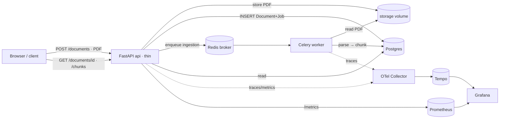

# UniPress DE — Project Structure

> Documentation of the repository layout, components, and data flow.
> **Reflects the codebase as of Phase 2 (complete).** The full production stack
> runs end-to-end (Phase 0); **PDF ingestion → chunking** (1a), **quote-verified
> claim extraction** (1b), **embeddings → Chroma retrieval** (1c), and
> **claim-bound generation + the full TrustLayer** (2a numeric/overlap core +
> 2b NLI, LLM judge, coverage) are implemented and verified. Phase 3 (bilingual
> outputs + rendering) is next — see [Status & maturity](#status--maturity).
> Everything below is based on the actual committed files, not planned features.
>
> 🔄 **This is a living document — keep it current.** Whenever a change adds or
> removes a service, entry point, route, model, migration, env var, dependency,
> or top-level folder — or completes a phase — update the affected sections
> (tree, tables, env vars, data flow, status) in the *same* change. Base every
> entry on the real files; mark built vs. planned; never invent a file's purpose.

---

## 1. What this project is

UniPress DE turns a research paper (PDF) into bilingual (Hungarian + English)
science-communication materials — press release, lay article, social posts,
executive summary, video script — where **every claim is traced to its source
and audited for hallucination** before human review. See [`README.md`](README.md)
and [`docs/01-project-definition.md`](docs/01-project-definition.md) for the
product framing.

The repository is a **monorepo** with three deployable units (`api`, `worker`,
`frontend`), an observability/ops layer, a planning-docs series, and a dataset
manifest, all wired together by Docker Compose.

---

## 2. Visual directory tree

```
unipress-de/
├── api/                         # Python backend: FastAPI API + Celery worker (shared image)
│   ├── app/
│   │   ├── __init__.py
│   │   ├── main.py              # ★ API entry point (FastAPI app)
│   │   ├── models.py            # Pydantic API contracts (JobCreate, JobRead, JobStatus)
│   │   ├── db_models.py         # SQLAlchemy tables (Job)
│   │   ├── api/                 # HTTP route handlers
│   │   │   ├── health.py        #   /health, /ready
│   │   │   ├── jobs.py          #   POST /jobs, GET /jobs/{id}
│   │   │   ├── documents.py     #   POST /documents (upload), GET /documents/{id}(/chunks)
│   │   │   └── deps.py          #   FastAPI DI (get_storage), overridable in tests
│   │   ├── core/                # Cross-cutting infrastructure
│   │   │   ├── settings.py      #   Typed env config (pydantic-settings)
│   │   │   ├── db.py            #   SQLAlchemy engine + session + Base
│   │   │   ├── logging.py       #   structlog JSON logging
│   │   │   └── telemetry.py     #   OpenTelemetry tracing setup
│   │   ├── ingestion/           # PDF → structured, span-linked text → chunks
│   │   │   ├── models.py        #   SourceSpan, Block, Page, ParsedDoc, Chunk (Pydantic)
│   │   │   ├── parser.py        #   PyMuPDF parse: text + bbox, image-only detection
│   │   │   ├── chunker.py       #   Structure-aware chunking with exact provenance
│   │   │   └── service.py       #   parse_stage / chunk_stage (persist; used by tasks)
│   │   ├── claims/              # Chunks → atomic, quote-verified claims
│   │   │   ├── models.py        #   ClaimType, Claim (Pydantic)
│   │   │   ├── guardrail.py     #   ★ quote-verification (the trust primitive)
│   │   │   ├── heuristic.py     #   Deterministic extractor (no LLM; default)
│   │   │   ├── llm_extractor.py #   Schema-constrained LLM extractor (opt-in)
│   │   │   └── service.py       #   extract_stage (choose extractor, persist claims)
│   │   ├── retrieval/           # Embed chunks + semantic search (the RAG 'R')
│   │   │   ├── types.py         #   VectorHit
│   │   │   ├── embedder.py      #   SentenceTransformer (e5-small) + hashing stub
│   │   │   ├── memory_store.py  #   InMemoryVectorStore (tests/local)
│   │   │   ├── chroma_store.py  #   ChromaVectorStore (production)
│   │   │   └── service.py       #   embed_stage + search + store/embedder factories
│   │   ├── generation/          # Claim-bound generation (docs/04)
│   │   │   ├── models.py        #   OutputType, SentenceRole, Verdict, GeneratedOutput, OutputSpec
│   │   │   ├── specs.py         #   Per-type specs (press release, exec summary)
│   │   │   ├── fallback.py      #   Deterministic generator (no key; default)
│   │   │   ├── llm_generator.py #   Schema-constrained LLM generator (opt-in)
│   │   │   └── service.py       #   generate → verify → persist
│   │   ├── trustlayer/          # Verify each sentence vs its cited source (docs/03 §5)
│   │   │   ├── numeric.py       #   Numeric-mismatch check (hard fail)
│   │   │   ├── entailment.py    #   Entailment port + lexical proxy; classify() 3-way
│   │   │   ├── nli.py           #   DebertaNLI (mDeBERTa-XNLI, opt-in via nli_backend)
│   │   │   ├── judge.py         #   Tier-2 LLM judge (gpt-4o-mini, opt-in)
│   │   │   ├── scorer.py        #   Confidence blend + numeric penalty
│   │   │   ├── coverage.py      #   Document-level coverage (dropped-caveat warnings)
│   │   │   └── verify.py        #   T1 gating → T2 judge → verdict + confidence
│   │   ├── llm/                 # LLM access
│   │   │   └── gateway.py       #   LiteLLMGateway (LLMGateway port; retry/timeout)
│   │   ├── ports/               # Hexagonal interfaces (Protocols)
│   │   │   └── base.py          #   VectorStore, LLMGateway, Storage, TaskDispatch
│   │   ├── adapters/            # Concrete implementations of the ports
│   │   │   └── stubs.py         #   EchoLLM / LocalStorage / CeleryTaskDispatch stubs
│   │   └── tasks/               # Async processing
│   │       ├── celery_app.py    #   ★ Celery worker entry point
│   │       └── chains.py        #   Demo + ingestion (parse→chunk→extract→embed) + generation chains
│   ├── alembic/                 # Database migrations
│   │   ├── env.py
│   │   ├── script.py.mako
│   │   └── versions/
│   │       ├── 0001_initial.py  #   Creates the `jobs` table
│   │       ├── 0002_documents_chunks.py  # documents + chunks tables; jobs.document_id
│   │       ├── 0003_claims.py   #   claims table; documents.claim_count
│   │       ├── 0004_outputs.py  #   outputs + output_sentences tables
│   │       └── 0005_output_coverage.py  # outputs.coverage (document-level report)
│   ├── alembic.ini
│   ├── tests/                   # pytest suite (SQLite-backed, no infra needed)
│   │   ├── conftest.py
│   │   ├── test_health.py
│   │   ├── test_jobs.py
│   │   ├── test_ingestion.py    #   Parser + chunker (in-memory generated PDF)
│   │   ├── test_documents.py    #   Upload → ingest → chunks API flow
│   │   ├── test_claims.py       #   Guardrail + heuristic extractor + claims API
│   │   ├── test_retrieval.py    #   Embedder + vector store + search endpoint
│   │   ├── test_generation.py   #   Claim-bound generation API + verdicts
│   │   └── test_trustlayer.py   #   Numeric-mismatch + verdict assignment
│   ├── pyproject.toml           # Python deps + tool config (ruff/mypy/pytest)
│   ├── uv.lock                  # Pinned, reproducible dependency lockfile
│   ├── Dockerfile               # Builds the shared api/worker image
│   └── .dockerignore
│
├── worker/
│   └── README.md                # Explains the worker shares api/'s image (no build yet)
│
├── frontend/                    # Next.js 14 (App Router) + TypeScript + Tailwind
│   ├── app/
│   │   ├── layout.tsx           #   Root layout + metadata
│   │   ├── page.tsx             #   ★ UI: submit a job, poll stage progress
│   │   └── globals.css          #   Tailwind entry + base styles
│   ├── package.json
│   ├── pnpm-lock.yaml
│   ├── next.config.mjs          # Standalone output build
│   ├── tsconfig.json
│   ├── tailwind.config.ts
│   ├── postcss.config.mjs
│   ├── next-env.d.ts
│   ├── Dockerfile               # Multi-stage standalone runtime image
│   └── .dockerignore
│
├── ops/                         # Observability & infra configs (mounted into containers)
│   ├── otel-collector/config.yaml   # OTLP receiver → Tempo
│   ├── prometheus/prometheus.yml    # Scrapes api /metrics
│   ├── tempo/tempo.yaml             # Trace storage
│   └── grafana/provisioning/datasources/datasources.yaml
│
├── docs/                        # Design/planning series (01–08) — source of truth
│   ├── 01-project-definition.md
│   ├── 02-architecture.md
│   ├── 03-ai-pipeline.md
│   ├── 04-content-outputs.md
│   ├── 05-evaluation.md
│   ├── 06-dataset-strategy.md
│   ├── 07-tech-stack.md
│   └── 08-dev-plan.md
│
├── data/
│   └── manifest.yaml            # Provenance + license for the sample corpus (PDFs gitignored)
│
├── sample_files_for_PR/         # Source PDFs — GITIGNORED, not committed
│
├── docker-compose.yml           # ★ Service topology (profiles: core|observability|ml|local-llm)
├── docker-compose.override.yml  # Local-dev port publishing
├── .env.example                 # Template for .env (real .env is gitignored)
├── .github/workflows/ci.yml     # CI: lint, type-check, test, build
├── .pre-commit-config.yaml      # Pre-commit hooks (ruff, mypy, hygiene)
├── .gitignore
├── README.md
└── PROJECT_STRUCTURE.md         # This file

# Present but gitignored (not part of the committed codebase):
#   DEIK_AI_Challenge_2026.md, prompt.md   → private planning inputs
#   .env                                    → local secrets
#   .claude/settings.local.json             → local Claude Code settings
#   api/.venv, frontend/node_modules, caches → generated
```

★ = application entry point.

---

## 3. Top-level layout by purpose

| Path | Type | Purpose | Why it matters |
|---|---|---|---|
| `api/` | Backend | FastAPI API + Celery worker (one shared image) | The whole domain/business logic lives here |
| `worker/` | Backend (doc only) | Placeholder for the future ML-heavy worker image | Currently reuses `api/`'s image; splits later (see below) |
| `frontend/` | Frontend | Next.js evidence-review UI | The product surface and demo |
| `ops/` | Infra config | OTel/Prometheus/Tempo/Grafana configs | Observability is a first-class, day-one concern |
| `docs/` | Documentation | Numbered design series `01`–`08` | The living source of truth; a competition asset |
| `data/` | Data | `manifest.yaml` (provenance/licensing) | Legal/attribution record for the corpus |
| `sample_files_for_PR/` | Data (ignored) | The 6 sample source PDFs | Input corpus; not committed (size + licensing) |
| repo root | Config | Compose, CI, env template, pre-commit | Ties the services into one runnable system |

---

## 4. Entry points

| Entry point | File | How it starts | Serves |
|---|---|---|---|
| **HTTP API** | [`api/app/main.py`](api/app/main.py) | `uvicorn app.main:app` | REST endpoints, `/metrics`, `/docs` |
| **Celery worker** | [`api/app/tasks/celery_app.py`](api/app/tasks/celery_app.py) | `celery -A app.tasks.celery_app.celery worker` | Executes async pipeline tasks |
| **Flower** | (same Celery app) | `celery -A app.tasks.celery_app.celery flower` | Queue/worker monitoring UI |
| **Migrations** | [`api/alembic/env.py`](api/alembic/env.py) | `alembic upgrade head` (one-shot `migrate` service) | Applies schema before api/worker boot |
| **Frontend** | [`frontend/app/page.tsx`](frontend/app/page.tsx) | `node server.js` (Next standalone) | The browser UI |

The `api`, `worker`, and `flower` **all run from the same Docker image**
(`api/Dockerfile`); only the start command differs. This is a deliberate Phase-0
choice documented in [`worker/README.md`](worker/README.md): the worker loads no
ML models yet, so a second image would be duplication. It graduates to its own
ML-heavy image once embeddings/NLI land.

---

## 5. Backend (`api/`) in detail

### 5.1 Application core (`app/core/`)

| File | Responsibility |
|---|---|
| [`settings.py`](api/app/core/settings.py) | Typed, env-driven config via `pydantic-settings`. `get_settings()` is `lru_cache`d. Invalid config fails fast at boot. |
| [`db.py`](api/app/core/db.py) | Creates the SQLAlchemy `Engine` and `SessionLocal`, defines the declarative `Base`, and provides `session_scope()` (worker transactions) and `get_db()` (FastAPI dependency). |
| [`logging.py`](api/app/core/logging.py) | Configures `structlog` to emit structured JSON logs at the configured level. |
| [`telemetry.py`](api/app/core/telemetry.py) | Installs an OpenTelemetry `TracerProvider`. OTLP export is **conditional** — only active when `OTEL_EXPORTER_OTLP_ENDPOINT` is set, so the `core` profile runs cleanly without a collector. Also instruments Celery. |

### 5.2 Domain models

| File | Type | Contents |
|---|---|---|
| [`db_models.py`](api/app/db_models.py) | SQLAlchemy ORM | `Job`, `Document`, `Chunk`, `Claim`, plus `OutputRecord` (a generated output) and `SentenceRecord` (a generated sentence with role/claim_ids/verdict/confidence/rationale). |
| [`models.py`](api/app/models.py) | Pydantic | API contracts: `JobRead`, `DocumentRead`, `ChunkRead`, `ClaimRead`, `SearchHit`, `GenerateRequest`, `OutputSummary`/`OutputDetail`, `SentenceRead`. |
| [`ingestion/models.py`](api/app/ingestion/models.py) | Pydantic | `SourceSpan` (docs/03 §1.1), `Block`, `Page`, `ParsedDoc`, `Chunk`. |
| [`claims/models.py`](api/app/claims/models.py) | Pydantic | `ClaimType` (docs/03 §2.2), `Claim` (docs/03 §1.2). |
| [`generation/models.py`](api/app/generation/models.py) | Pydantic | `OutputType`, `SentenceRole`, `Verdict`, `GeneratedSentence`/`GeneratedOutput` (docs/03 §1.3–1.4), `OutputSpec`. |

### 5.3 Ports & adapters (hexagonal architecture)

The domain depends on **interfaces**, never concrete infrastructure, so backends
are swappable. This is the key architectural pattern.

| Port ([`ports/base.py`](api/app/ports/base.py)) | Purpose | Phase-0 adapter ([`adapters/stubs.py`](api/app/adapters/stubs.py)) | Graduation target |
|---|---|---|---|
| `VectorStore` | Embedding index (add/query/delete over vectors + metadata) | `ChromaVectorStore` (real) + `InMemoryVectorStore` (tests) in [`retrieval/`](api/app/retrieval/) | Chroma → Qdrant |
| `LLMGateway` | Text generation | `EchoLLM` stub **and** `LiteLLMGateway` ([`llm/gateway.py`](api/app/llm/gateway.py), real, opt-in) | LiteLLM (OpenAI/Ollama) — done |
| `Storage` | Blob storage | `LocalStorage` (local FS, now storing uploaded PDFs + parse artifacts) | MinIO / S3 |
| `TaskDispatch` | Async job dispatch | `CeleryTaskDispatch` (`enqueue_pipeline`, `enqueue_ingestion`) | (Celery kept) |

Ports are `runtime_checkable` `Protocol`s, so `isinstance()` verifies an adapter
satisfies a port — [`tests/test_jobs.py`](api/tests/test_jobs.py) asserts exactly this.

### 5.4 API routes (`app/api/`)

| Method & path | Handler | Responsibility |
|---|---|---|
| `GET /health` | [`health.py`](api/app/api/health.py) | Liveness — process is up (no deps checked). Used by the container healthcheck. |
| `GET /ready` | `health.py` | Readiness — executes `SELECT 1` to confirm the DB is reachable. |
| `POST /jobs` | [`jobs.py`](api/app/api/jobs.py) | Creates a `Job` row (status `pending`), then enqueues the demo pipeline. Returns immediately (201). |
| `GET /jobs/{id}` | `jobs.py` | Reads current job state (404 if missing). The frontend polls this. |
| `POST /documents` | [`documents.py`](api/app/api/documents.py) | Uploads a PDF (multipart), stores it via the `Storage` port, creates a `Document`+`Job`, enqueues the ingestion chain (201). Validates `.pdf` + size cap. |
| `GET /documents/{id}` | `documents.py` | Ingestion status: page/chunk counts, warnings, errors (404 if missing). |
| `GET /documents/{id}/chunks` | `documents.py` | Ordered chunks with spans (page/section/offsets/bbox) — the evidence-highlight source. |
| `GET /documents/{id}/claims` | `documents.py` | Extracted claims: text, type, quote, span, numeric flag, importance. |
| `POST /documents/{id}/search` | `documents.py` | Semantic search (RAG retrieval): embeds the query, queries the vector store, returns span-linked chunk hits with scores. |
| `POST /documents/{id}/outputs` | `documents.py` | Enqueue claim-bound generation of one output type/language (202; poll job, `result` = output id). |
| `GET /documents/{id}/outputs` | `documents.py` | List generated outputs for a document. |
| `GET /documents/outputs/{id}` | `documents.py` | Full output: each sentence with role, cited claim ids, **verdict + confidence** (the evidence-review payload). |
| `GET /` | [`main.py`](api/app/main.py) | Service metadata. |
| `GET /metrics` | (Instrumentator) | Prometheus metrics, scraped by Prometheus. |
| `GET /docs` | (FastAPI) | OpenAPI/Swagger UI. |

The API is **thin by design**: validate → enqueue → read. All heavy work is
delegated to the worker.

### 5.5 Background jobs / queue (`app/tasks/`)

| File | Role |
|---|---|
| [`celery_app.py`](api/app/tasks/celery_app.py) | Defines the `celery` app. **Redis is both broker and result backend.** Configures JSON serialization, `task_acks_late`, `prefetch_multiplier=1`. Wires tracing so api→worker spans connect. |
| [`chains.py`](api/app/tasks/chains.py) | Two Celery chains: (1) the **demo** `start_pipeline(job_id)` (still backs `POST /jobs`); (2) the **real ingestion** `start_ingestion(job_id, document_id)` = `parse → chunk → extract → embed → finalize`, delegating to the `ingestion` / `claims` / `retrieval` services, with per-stage failure capture → `failed`. |

**Queue mechanics (ingestion):** `POST /documents` stores the PDF →
`CeleryTaskDispatch.enqueue_ingestion` → `start_ingestion` → `parse_stage`
(writes `parsed.json` + page metadata) → `chunk_stage` (writes `Chunk` rows) →
`extract_stage` (quote-verifies `Claim` rows) → `embed_stage` (embeds chunks into
the vector store) → `finalize`. Stages re-load from storage/DB by id, so no large
payloads cross the broker and each stage is idempotent.

### 5.6 Database, migrations & schema

- **ORM/engine:** [`app/core/db.py`](api/app/core/db.py) — synchronous SQLAlchemy 2.x with `psycopg` (Postgres 16).
- **Migrations:** Alembic. [`alembic/env.py`](api/alembic/env.py) pulls the URL and `Base.metadata` from the app (no duplicated config) and imports `db_models` so tables register.
- **`0001_initial`** ([versions/0001_initial.py](api/alembic/versions/0001_initial.py)) — `jobs` table + `ix_jobs_status`.
- **`0002_documents_chunks`** ([versions/0002_documents_chunks.py](api/alembic/versions/0002_documents_chunks.py)) — `documents` + `chunks` tables (FK `chunks.document_id → documents.id`, cascade) and `jobs.document_id`.
- **`0003_claims`** ([versions/0003_claims.py](api/alembic/versions/0003_claims.py)) — `claims` table (FK to `documents`, cascade) and `documents.claim_count`.
- **`0004_outputs`** ([versions/0004_outputs.py](api/alembic/versions/0004_outputs.py)) — `outputs` + `output_sentences` tables (cascade), holding generated outputs and per-sentence verdicts.
- **`0005_output_coverage`** ([versions/0005_output_coverage.py](api/alembic/versions/0005_output_coverage.py)) — `outputs.coverage` JSON (document-level coverage report).
- Migrations run via a **one-shot `migrate` service** in Compose that must complete successfully before `api`/`worker` start (`service_completed_successfully`).

### 5.7 Tests (`api/tests/`)

| File | Covers |
|---|---|
| [`conftest.py`](api/tests/conftest.py) | Fixture that swaps the app's DB session for an **in-memory SQLite** engine, routes `Storage` to a tmp dir, and stubs the Celery dispatch to run inline — so tests need **no Postgres, Redis, or Celery**. |
| [`test_health.py`](api/tests/test_health.py) | `/health`, `/ready`, `/` responses. |
| [`test_jobs.py`](api/tests/test_jobs.py) | Job create+read round-trip, 404 handling, and that stub adapters satisfy their ports. |
| [`test_ingestion.py`](api/tests/test_ingestion.py) | Parser + chunker on an in-memory generated PDF: page/text extraction, **chunk provenance integrity** (quote == page-text substring), image-only detection. |
| [`test_documents.py`](api/tests/test_documents.py) | Upload → ingest → chunks API flow; non-PDF rejection; 404. |

**Testing strategy:** fast, hermetic unit/integration tests against SQLite with
external systems stubbed; CI also runs an ephemeral-service-free suite. Heavier
integration (real Postgres/Redis) and the eval harness arrive in later phases
(see [`docs/08-dev-plan.md`](docs/08-dev-plan.md) P5).

---

## 6. Frontend (`frontend/`)

A Next.js 14 App Router application (TypeScript + Tailwind).

| File | Role |
|---|---|
| [`app/page.tsx`](frontend/app/page.tsx) | Client component. Calls `POST /jobs`, then **polls** `GET /jobs/{id}` every ~700 ms, rendering a stage checklist (`queued → ingest → parse → embed → verify → done`) until a terminal state. This is the Phase-0 stand-in for the evidence-review dashboard. |
| [`app/layout.tsx`](frontend/app/layout.tsx) | Root HTML layout + page metadata. |
| [`app/globals.css`](frontend/app/globals.css) | Tailwind directives + base body styles. |
| [`next.config.mjs`](frontend/next.config.mjs) | `output: "standalone"` for a small runtime image. |
| [`Dockerfile`](frontend/Dockerfile) | Multi-stage: deps → build → minimal `node` runtime serving `server.js`. |

**API base URL:** the browser reads `NEXT_PUBLIC_API_BASE` (defaults to
`http://localhost:8000`). In production the frontend and API share one origin
behind Nginx (no CORS); in local dev CORS is enabled on the API (see below).

---

## 7. Configuration files

| File | Configures |
|---|---|
| [`.env.example`](.env.example) | Template listing every env var (see [Environment variables](#10-environment-variables)). Copy to `.env` (gitignored). |
| [`api/pyproject.toml`](api/pyproject.toml) | Python project: runtime deps, `dev` dependency group, and tool config for **ruff** (lint+format, line length 100), **mypy** (pydantic plugin), **pytest** (asyncio auto). |
| [`api/uv.lock`](api/uv.lock) | Fully pinned dependency graph for reproducible installs (`uv sync --frozen`). |
| [`frontend/package.json`](frontend/package.json) + [`pnpm-lock.yaml`](frontend/pnpm-lock.yaml) | Frontend deps and scripts (`dev`/`build`/`start`/`lint`), pinned via pnpm. |
| [`frontend/tsconfig.json`](frontend/tsconfig.json), [`tailwind.config.ts`](frontend/tailwind.config.ts), [`postcss.config.mjs`](frontend/postcss.config.mjs) | TypeScript, Tailwind, PostCSS. |
| [`.pre-commit-config.yaml`](.pre-commit-config.yaml) | Pre-commit hooks: ruff (fix+format on `api/`), mypy on `app/`, plus hygiene hooks (EOF, trailing whitespace, YAML/large-file/merge-conflict checks). |
| [`.gitignore`](.gitignore) | Excludes secrets, venvs, `node_modules`, ML artifacts, PDFs, generated caches. |

---

## 8. Docker, Compose & infrastructure

### 8.1 Compose topology

[`docker-compose.yml`](docker-compose.yml) defines all services, grouped by
**profiles** so you run only what you need:

| Profile | Services | Notes |
|---|---|---|
| `core` | `postgres`, `redis`, `migrate`, `api`, `worker`, `flower`, `frontend` | The application. |
| `observability` | `otel-collector`, `prometheus`, `tempo`, `grafana` | Opt-in monitoring stack. |
| `ml` | `mlflow` | Eval/experiment tracking (used from Phase 5). |
| `local-llm` | `ollama` | Optional local-LLM path for the privacy demo. |

Key details:
- A shared `x-app-env` anchor injects `DATABASE_URL`, `REDIS_URL`, and OTel vars into `api`/`worker`/`migrate`/`flower`.
- **Health-gated startup:** `api`/`worker` wait for `postgres`+`redis` healthy and `migrate` completed.
- Named volumes persist Postgres, Redis (AOF), **uploaded PDFs + parse artifacts (`storage`, shared by api+worker)**, Tempo, Grafana, MLflow, and Ollama data.
- [`docker-compose.override.yml`](docker-compose.override.yml) publishes host ports for local dev (api `8000`, frontend `3000`, flower `5555`, prometheus `9090`, grafana `3001`, tempo `3200`, mlflow `5000`) and sets `NEXT_PUBLIC_API_BASE`.

### 8.2 Images

| Dockerfile | Builds | Base |
|---|---|---|
| [`api/Dockerfile`](api/Dockerfile) | Shared api/worker/flower/migrate image; installs deps with `uv` in two cached layers. | `python:3.12-slim` |
| [`frontend/Dockerfile`](frontend/Dockerfile) | Next.js standalone runtime. | `node:20-alpine` |

### 8.3 Observability configs (`ops/`)

| File | Configures |
|---|---|
| [`ops/otel-collector/config.yaml`](ops/otel-collector/config.yaml) | Receives OTLP (gRPC 4317 / HTTP 4318), batches, exports **traces → Tempo**. |
| [`ops/prometheus/prometheus.yml`](ops/prometheus/prometheus.yml) | Scrapes the api's `/metrics` and itself (15s interval). |
| [`ops/tempo/tempo.yaml`](ops/tempo/tempo.yaml) | Single-binary Tempo with local trace storage, OTLP gRPC ingest, 24h retention. |
| [`ops/grafana/.../datasources.yaml`](ops/grafana/provisioning/datasources/datasources.yaml) | Provisions Prometheus (default) + Tempo datasources. |

> There is **no Kubernetes, Terraform, or Nginx config in the repo yet.** The
> production deployment (Angani VM, Nginx + Certbot TLS, backups) is *specified*
> in [`docs/07-tech-stack.md`](docs/07-tech-stack.md) §9 but not yet codified —
> it lands in Phase 6.

### 8.4 CI/CD

[`.github/workflows/ci.yml`](.github/workflows/ci.yml) runs on push/PR to
`master`/`dev`:

- **backend job:** `uv sync --frozen` → `ruff check` → `ruff format --check` → `mypy app` → `pytest`.
- **frontend job:** `pnpm install --frozen-lockfile` → `tsc --noEmit` → `pnpm build`.

The eval-gate and deploy steps referenced in the plan are future (Phase 5/6).

---

## 9. Authentication & authorization

**None yet.** There is no auth/authz layer in the Phase-0 codebase — no login,
sessions, tokens, or role checks. Per [`docs/02-architecture.md`](docs/02-architecture.md)
§8, SSO/auth and multi-tenancy are explicitly a *production graduation*, not an
MVP feature. The only access controls today are network-level (intended: data
services stay on the internal Docker network; Grafana behind admin auth).

---

## 10. Environment variables

Defined in [`.env.example`](.env.example) and consumed by
[`api/app/core/settings.py`](api/app/core/settings.py) and Compose. **No secret
values are stored in the repo** — `.env` is gitignored.

| Variable | Used by | Purpose |
|---|---|---|
| `APP_ENV` | api/worker | Environment name (e.g. development). |
| `LOG_LEVEL` | api/worker | structlog level. |
| `OTEL_SERVICE_NAME` | api/worker | Service name on traces. |
| `OTEL_EXPORTER_OTLP_ENDPOINT` | api/worker | OTLP collector endpoint; **empty disables trace export**. |
| `POSTGRES_USER` / `POSTGRES_PASSWORD` / `POSTGRES_DB` | postgres, `DATABASE_URL` | DB credentials/name (**secret** — set in `.env`). |
| `DATABASE_URL` | api/worker/migrate | Full SQLAlchemy connection string (assembled in Compose). |
| `REDIS_URL` | api/worker | Celery broker + result backend. |
| `STORAGE_ROOT` | api/worker | Filesystem root for uploaded PDFs + parse artifacts (`/data/storage` in Compose). |
| `CHROMA_URL` | api/worker | Chroma HTTP endpoint (`http://chroma:8000` in Compose); empty → local persistent Chroma. |
| `EMBED_MODEL` | api/worker | Embedding model (default `intfloat/multilingual-e5-small`; set `BAAI/bge-m3` on the VM). |
| `HF_HOME` | api/worker | HuggingFace cache dir (`/data/hf-cache` volume) so model weights download once. |
| `GRAFANA_ADMIN_PASSWORD` | grafana | Grafana admin password (**secret**). |
| `OPENAI_API_KEY` | api/worker | LLM key (**secret**). Only used when `LLM_EXTRACTION=true`; empty by default. |
| `LLM_EXTRACTION` | api/worker | Opt-in flag for the LLM claim extractor (default `false` → deterministic heuristic, no API calls/spend). |
| `LLM_EXTRACT_MODEL` / `LLM_JUDGE_MODEL` / `LLM_GENERATION_MODEL` | api/worker | Per-stage model routing (defaults: `gpt-4o-mini`/`gpt-4o-mini`/`gpt-4o`). |
| `NEXT_PUBLIC_API_BASE` | frontend (browser) | API base URL for browser calls. |
| `cors_origins` (setting) | api | Allowed CORS origins; defaults to `http://localhost:3000` for local dev. |

---

## 11. External integrations & third-party services

| Service | Status | Where |
|---|---|---|
| **PostgreSQL 16** | Active | Relational store (jobs, later claims/spans). |
| **Redis 7** | Active | Celery broker + result backend. |
| **OpenTelemetry Collector / Tempo / Prometheus / Grafana** | Active (observability profile) | Traces, metrics, dashboards. |
| **MLflow** | Scaffolded (ml profile) | Eval/experiment tracking (Phase 5). |
| **Ollama** | Scaffolded (local-llm profile) | Optional local LLM. |
| **OpenAI (via LiteLLM)** | Wired, opt-in | `LiteLLMGateway` + LLM claim extractor; only called when `LLM_EXTRACTION=true`. |
| **PyMuPDF** | Active | PDF parsing (text + bbox). |
| **Chroma** | Active (core profile) | Vector store for chunk embeddings. |
| **sentence-transformers (e5-small; BGE-M3 swappable)** | Active | Local embeddings for retrieval. |
| **DeBERTa NLI, bge-reranker, GROBID** | Planned | NLI/rerank land in Phase 2 / later 1c. |

---

## 12. Documentation & data

- [`docs/01`–`08`](docs/) — the numbered design series (definition → architecture → AI pipeline → outputs → evaluation → dataset → tech stack → dev plan). These are the **authoritative design record** and are kept in sync with the code as it's built.
- [`data/manifest.yaml`](data/manifest.yaml) — provenance, authorship, DOI, and license for each of the 6 sample documents. The **PDFs themselves live in `sample_files_for_PR/` and are gitignored** (size + licensing); only the manifest is committed.

---

## 13. Architecture & data flow



**Ingestion data flow (current, Phase 1a):**
1. A client uploads a PDF (`POST /documents`). The API stores the bytes via the `Storage` port, writes a `pending` `Document` + `Job`, enqueues the ingestion chain, and returns immediately.
2. The worker runs `parse` (PyMuPDF → text + bbox spans, persisted as `parsed.json`), `chunk` (structure-aware chunks with exact `SourceSpan` → `Chunk` rows), `extract` (atomic claims, each **quote-verified** → `Claim` rows), `embed` (chunk embeddings → Chroma), then `finalize`.
3. The client reads `GET /documents/{id}` (status, page/chunk/claim counts, warnings), `/chunks`, `/claims`, and runs `POST /documents/{id}/search` for semantic retrieval over the embedded chunks.
4. Throughout, api + worker emit traces (→ OTel → Tempo) and metrics (→ Prometheus → Grafana).

> The demo `POST /jobs` path from Phase 0 still exists for the frontend shell;
> the frontend moves onto `/documents` in Phase 4. Claim extraction, embeddings/
> retrieval, generation, and the TrustLayer slot into later stages **behind the
> same ports**, without reshaping this skeleton.

---

## 14. Status & maturity

| Layer | State |
|---|---|
| Repo scaffolding, Compose, CI, ports/adapters | **Implemented & verified** (Phase 0) |
| Job model, API, Celery demo chain, migrations | **Implemented & verified** |
| Frontend job-submit/poll shell | **Implemented** |
| Observability wiring | **Implemented** (trace-in-Tempo confirmation still pending) |
| **PDF ingestion: upload → parse (spans/bbox) → chunk** | **Implemented & verified** (Phase 1a) |
| **Claim extraction (quote-verified `Claim` store; heuristic + opt-in LLM)** | **Implemented & verified** (Phase 1b) |
| **Embeddings → Chroma retrieval + semantic search** | **Implemented & verified** (Phase 1c) |
| Reranker (bge-reranker); eval gold set + MLflow A/B | **Not started** (rest of Phase 1) |
| **Claim-bound generation + TrustLayer (numeric, NLI, judge, coverage)** | **Implemented & verified** (Phase 2a+2b) |
| Pairwise-NLI consistency check; thresholds tuning → MLflow | **Deferred** (Phase 5 harness) |
| Bilingual outputs, review dashboard, eval harness, deployment | **Not started** (Phases 3–6) |

No files in the committed tree appear **dead or deprecated** — everything present
is active. The `VectorStore`/`LLMGateway` stub adapters and the demo `/jobs` chain
are intentional placeholders, not dead code. See
[`docs/08-dev-plan.md`](docs/08-dev-plan.md) for the phase roadmap.
