# UniPress DE

> **Trustworthy, traceable science communication — at 10× speed.**
> DEIK.AI Challenge 2026 · Category 2.C (AI-Assisted PR Content Generation)

UniPress DE turns a research paper (PDF) into publication-ready, **bilingual (Hungarian + English)** communication materials — press release, lay article, social posts, executive summary, and a 60-second video script — where **every factual claim is linked to its exact source and audited for hallucination before a human ever sees it.**

Generic AI tools generate fluent, confident text with no evidence trail, so a press officer can't trust the output without re-reading the whole paper. UniPress DE is verification-first: it decomposes the paper into quote-anchored claims, generates content structurally bound to those claims, and independently checks every generated sentence against its cited evidence.

---

## Live demo

The system runs on a public HTTPS host — a single origin behind nginx, so the app, the API and the dashboard all share one domain.

| | URL |
|---|---|
| **The app** — upload → generate → review evidence → export | **<https://unipress.gilbertmutai.com/>** |
| **Trust & Ops dashboard** — live eval + ops metrics (Grafana, read-only) | <https://unipress.gilbertmutai.com/grafana/d/unipress-overview> |
| **API reference** — interactive Swagger UI | <https://unipress.gilbertmutai.com/api/docs> |
| API reference — ReDoc · raw schema | [`/api/redoc`](https://unipress.gilbertmutai.com/api/redoc) · [`/api/openapi.json`](https://unipress.gilbertmutai.com/api/openapi.json) |
| Health probes — liveness · readiness (checks the DB) | [`/api/health`](https://unipress.gilbertmutai.com/api/health) · [`/api/ready`](https://unipress.gilbertmutai.com/api/ready) |

Every API route lives under `/api` (nginx strips the prefix before proxying). Only 80/443 are published — Prometheus, Flower, MLflow and Tempo stay on the internal Docker network and are reachable in local dev only (see [Quickstart](#quickstart)).

## Why it's different

- **Evidence-linked claims** — every generated sentence traces back to a page / section / verbatim quote.
- **TrustLayer** — each sentence is typed (*explicit fact · reasonable interpretation · rhetorical framing · unsupported*), grounded via an NLI + LLM-judge check, and confidence-scored; unsupported or numerically-wrong claims are blocked or flagged.
- **Bilingual scientific rewriting** (HU↔EN) — audience-adapted, not literal translation.
- **Human-in-the-loop review dashboard** — accept / edit / flag each element with the source shown alongside.
- **Multi-audience fan-out** from one verified claim store — write the facts once, render for five audiences.

## How it works

Nothing is written from the paper directly. The paper first becomes a store of **quote-anchored claims**, generation is then *bound* to those claims, and every generated sentence is independently checked against the exact quote it cites. Provenance is established before a single word is written, and re-verified after.

```mermaid
flowchart LR
    subgraph IN["① Ingest — establish provenance"]
        direction TB
        PDF[["PDF upload"]] --> PARSE["<b>Parse</b><br/>PyMuPDF · text + page/char spans + bbox"]
        PARSE --> CHUNK["<b>Chunk</b><br/>~900 chars, section-aware"]
        CHUNK --> EX["<b>Extract claims</b><br/>heuristic rules or gpt-4o-mini"]
        EX --> GUARD{"<b>Quote guardrail</b><br/>is the quote verbatim<br/>in the source?"}
        GUARD -->|"no"| DROP["Claim rejected"]
        GUARD -->|"yes"| CS[("<b>Claim store</b><br/>quote + span + type")]
        CHUNK --> EMBED["<b>Embed</b><br/>multilingual-e5-small"]
        EMBED --> VS[("Vector store<br/>Chroma")]
    end

    subgraph GENB["② Generate — bound to claims"]
        direction TB
        SPEC["Output spec<br/>press release · article · social<br/>exec summary · video script"] --> GEN
        LANG["Language<br/>EN / HU"] --> GEN
        GEN["<b>Claim-bound generation</b><br/>gpt-4o · every sentence cites claim IDs<br/>and carries a role"]
    end

    subgraph TL["③ TrustLayer — verify per sentence"]
        direction TB
        NUM["<b>1 · Numeric check</b><br/>do the numbers match the quote?"] --> NLI
        NLI["<b>2 · Tier-1 entailment</b><br/>mDeBERTa XNLI, runs locally"] --> GATE{"entailment<br/>clearly high?"}
        GATE -->|"no / has numbers"| JUDGE["<b>3 · Tier-2 judge</b><br/>gpt-4o-mini + written rationale"]
        GATE -->|"yes"| SCORE
        JUDGE --> SCORE["<b>4 · Confidence</b><br/>0.4·entail + 0.4·judge + 0.2·overlap<br/>− numeric penalty"]
        SCORE --> VERDICT{"threshold"}
    end

    CS --> GEN
    GEN --> NUM
    VERDICT -->|"≥ 0.70"| SUP["SUPPORTED"]
    VERDICT -->|"≥ 0.45"| INT["INTERPRETATION"]
    VERDICT -->|"< 0.45"| UNS["UNSUPPORTED — flagged"]
    VERDICT -->|"number wrong /<br/>source disagrees"| CON["CONTRADICTED — blocked"]

    SUP & INT & UNS & CON --> REVIEW["<b>④ Human review</b><br/>evidence trail · source highlight<br/>accept / edit / flag"]
    VS -.->|"evidence lookup<br/>+ semantic search"| REVIEW
    REVIEW --> EXPORT[["Bilingual export<br/>HTML / PDF with attribution"]]

    style GUARD fill:#054434,color:#fff
    style CS fill:#054434,color:#fff
    style GEN fill:#054434,color:#fff
    style UNS fill:#fbab2c,color:#000
    style CON fill:#fbab2c,color:#000
```



### The stages in detail

**① Ingest — turn a paper into verifiable claims**

| Stage | What happens | Why it matters |
|---|---|---|
| **Parse** | PyMuPDF extracts text block by block, keeping each block's page number, character offsets and bounding box. | Those coordinates are what later let the UI highlight the exact sentence inside the original PDF. Without spans there is no visual evidence trail. |
| **Chunk** | Blocks are grouped into ~900-character chunks, with a running section label (Abstract, Methods, …) and the offsets carried through. | Small enough for an extractor to read closely, large enough to keep a claim's context intact. |
| **Extract claims** | Each chunk yields candidate claims, typed as `EXPLICIT_FACT`, `QUANTITATIVE`, `FINDING`, `METHOD`, `LIMITATION` or `BACKGROUND`. Deterministic rules by default; `gpt-4o-mini` when `LLM_EXTRACTION=true`. | The paper stops being prose and becomes a set of discrete, individually checkable facts. |
| **Quote guardrail** | Every candidate must have its quote located **verbatim** in the parsed source. Anything that can't be located is discarded. | This is the load-bearing step: it means every claim in the store is *already proven* to exist in the paper, before generation ever runs. |
| **Embed** | Chunks are embedded with `multilingual-e5-small` (Hungarian + English) into Chroma, with page/section/offset metadata. | Powers semantic search and evidence lookup. Note that generation does **not** read from here — see below. |

**② Generate — write from claims, not from the paper**

The generator receives the claim store, an output spec (one of five types) and a target language. It must produce sentences that **cite claim IDs**, and it tags each with a role: `FACT` (asserts something, must cite), `INTERPRETATION` (a reasonable inference), `RHETORICAL` (a hook — carries no factual load) or `TRANSITION`.

This is deliberately **not** classic RAG. Retrieval-augmented generation fetches top-k chunks and lets the model write freely over them, which leaves nothing structurally tying an output sentence to a specific source span. Binding to claims gives per-sentence provenance — the property the whole product depends on.

**③ TrustLayer — check every sentence against its own citation**

Verification is per sentence, and the premise is only the quotes of the claims *that sentence cites*:

1. **Numeric check** — a number in the sentence that the quote doesn't corroborate is a hard fail (`CONTRADICTED`), because a wrong figure is the most damaging error a press release can make.
2. **Tier-1 entailment** — mDeBERTa XNLI scores entail / neutral / contradict, locally and free.
3. **Tier-2 judge** — `gpt-4o-mini` runs when entailment isn't clearly high (< 0.85) or the sentence contains numbers, returning a supported-fraction *and a written rationale*. It exists because NLI answers a narrow question — "is this *strictly* entailed?" — and returns *neutral* for faithful paraphrases that add framing. The judge restores that nuance and produces the human-readable reason a reviewer sees.
4. **Confidence** — `0.4·entail + 0.4·judge + 0.2·quote_overlap`, minus a numeric penalty, thresholded into the verdict.

A sentence citing nothing, or citing a claim that isn't in the store, is `UNSUPPORTED` at confidence 0 — no benefit of the doubt.

**④ Human review — the reviewer is the last gate**

The dashboard shows each sentence with its role, verdict, confidence and cited quote, plus the highlighted region of the original PDF. Nothing is presented as automatically publishable: the reviewer accepts, edits or flags, then exports bilingual HTML/PDF with attribution.

## Tech stack

What actually runs, in the roles it plays:

| Layer | Component |
|---|---|
| API · async work | FastAPI · Celery + Redis · Flower |
| Stores | PostgreSQL + Alembic (claims, outputs, jobs) · Chroma (vectors) · volumes for uploads + model cache |
| Parsing | PyMuPDF (text, page/char spans, bounding boxes) |
| Embeddings | `intfloat/multilingual-e5-small` (HU + EN; BGE-M3 is a one-line `EMBED_MODEL` swap) |
| Trust — Tier 1 | `MoritzLaurer/mDeBERTa-v3-base-xnli-multilingual-nli-2mil7`, local, no API cost |
| Trust — Tier 2 | `gpt-4o-mini` judge via LiteLLM |
| Generation | `gpt-4o` via LiteLLM (provider-swappable; deterministic fallback with no key) |
| Frontend | Next.js 14 (App Router) + Tailwind |
| Edge | nginx single origin + Certbot TLS |
| Observability | Prometheus + Pushgateway · Grafana · OpenTelemetry → Tempo |
| Eval | custom metrics + RAGAS + textstat · MLflow tracking |
| Packaging | Docker Compose, profiled (`core`, `observability`, `ml`, `local-llm`) |

The reasoning behind each choice is in [`docs/07-tech-stack.md`](docs/07-tech-stack.md); the deployed shape is in [`docs/09-live-system.md`](docs/09-live-system.md).

## Quickstart

The whole system comes up with one command, and needs **no API key** to run — without one it uses a deterministic fallback generator, which is also what the test suites use:

```bash
cp .env.example .env        # optionally add an OpenAI key + LLM_GENERATION=true
docker compose --profile core up
# add --profile observability for the Grafana/OTel stack, --profile ml for MLflow
```

Locally the services publish their own ports (unlike production, where only nginx is exposed):

| URL | Service |
|---|---|
| <http://localhost:3000> | Frontend |
| <http://localhost:8000/docs> | API + Swagger UI |
| <http://localhost:3001> | Grafana (`admin` / `$GRAFANA_ADMIN_PASSWORD`) — `observability` profile |
| <http://localhost:9090> | Prometheus — `observability` profile |
| <http://localhost:3200> | Tempo (traces) — `observability` profile |
| <http://localhost:5555> | Flower (Celery queue inspector) |
| <http://localhost:5000> | MLflow (eval runs) — `ml` profile |

## Documentation

**Start here if you want to understand or use the running system:** [`docs/09-live-system.md`](docs/09-live-system.md) — the as-built guide. What is deployed, how to drive the API, how it is operated, what is measured, and where it falls short.

Docs `01`–`08` are the **design record**: the series was written before code, and it is kept as written so the reasoning behind each decision stays legible. Where a plan and the built system disagree, `09` is authoritative.

| # | Doc | Contents |
|---|---|---|
| **09** | [**The Live System**](docs/09-live-system.md) | **As-built: usage, API, operations, limitations** |
| 01 | [Project Definition](docs/01-project-definition.md) | Problem, users, pitch, scope |
| 02 | [System Architecture](docs/02-architecture.md) | Components, MVP/production split |
| 03 | [AI Pipeline & Anti-Hallucination](docs/03-ai-pipeline.md) | Data contracts, TrustLayer algorithm |
| 04 | [Content Generation Spec](docs/04-content-outputs.md) | The five output types |
| 05 | [Evaluation Framework](docs/05-evaluation.md) | Faithfulness, hallucination, readability metrics |
| 06 | [Dataset & Testing Strategy](docs/06-dataset-strategy.md) | Gold set, adversarial set, corpus |
| 07 | [Technology Stack](docs/07-tech-stack.md) | Justified tech choices |
| 08 | [MVP Development Plan](docs/08-dev-plan.md) | Phased build to the deadline |

## Dataset & licensing

The primary corpus is the challenge's official sample materials — four CC BY 4.0 research papers and two University of Debrecen curricula. Provenance and licensing per document are recorded in [`data/manifest.yaml`](data/manifest.yaml). Source PDFs are not committed to the repo. Attribution (title, authors, DOI, license) is shown on every generated output.

## Status

**Live and end-to-end on a public HTTPS URL.** Phases 0–5 complete; Phase 6 (deploy, harden, demo) substantially delivered — see the [phase log](docs/08-dev-plan.md#8-phase-6--deploy-harden--demo). Demo deadline: **25 September 2026**.

Working today, verified on the deployment:

- A paper runs the full pipeline and produces all **five output types in Hungarian and English**, each with a per-sentence evidence trail and source highlighting
- The **TrustLayer** blocks or flags unsupported and numerically-wrong claims — adversarial traps caught **5/5**, zero contradictions across the warm demo outputs
- **Grafana** shows live ops *and* eval metrics; the eval harness produces a versioned MLflow report
- Nightly backups, a **verified** zero-downtime restore rehearsal, and a scripted redeploy

Known gaps are listed honestly in [`09` §9](docs/09-live-system.md#9-known-limitations) — the main ones being `key_fact_coverage` below target (0.20), Hungarian confidence trailing English, and SSH hardening not yet applied to the VM.
