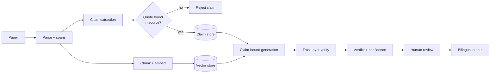

# UniPress DE

> **Trustworthy, traceable science communication — at 10× speed.**
> DEIK.AI Challenge 2026 · Category 2.C (AI-Assisted PR Content Generation)

UniPress DE turns a research paper (PDF) into publication-ready, **bilingual (Hungarian + English)** communication materials — press release, lay article, social posts, executive summary, and a 60-second video script — where **every factual claim is linked to its exact source and audited for hallucination before a human ever sees it.**

Generic AI tools generate fluent, confident text with no evidence trail, so a press officer can't trust the output without re-reading the whole paper. UniPress DE is verification-first: it decomposes the paper into quote-anchored claims, generates content structurally bound to those claims, and independently checks every generated sentence against its cited evidence.

---

## Why it's different

- **Evidence-linked claims** — every generated sentence traces back to a page / section / verbatim quote.
- **TrustLayer** — each sentence is typed (*explicit fact · reasonable interpretation · rhetorical framing · unsupported*), grounded via an NLI + LLM-judge check, and confidence-scored; unsupported or numerically-wrong claims are blocked or flagged.
- **Bilingual scientific rewriting** (HU↔EN) — audience-adapted, not literal translation.
- **Human-in-the-loop review dashboard** — accept / edit / flag each element with the source shown alongside.
- **Multi-audience fan-out** from one verified claim store — write the facts once, render for five audiences.

## How it works



## Tech stack (summary)

FastAPI · Celery + Redis · PostgreSQL + Alembic · Chroma (vectors) · BGE-M3 embeddings · DeBERTa NLI · LiteLLM → OpenAI (Ollama optional) · Next.js · OpenTelemetry / Prometheus / Grafana · Docker Compose. Full rationale in [`docs/07-tech-stack.md`](docs/07-tech-stack.md).

## Quickstart

> _Populated as the build lands (Phase 0). The whole system comes up with a single command:_

```bash
cp .env.example .env        # add your OpenAI key
docker compose --profile core up
# add --profile observability for the Grafana/OTel stack
```

## Documentation

The design is fully specified before code — the planning series lives in [`docs/`](docs/):

| # | Doc | Contents |
|---|---|---|
| 01 | [Project Definition](docs/01-project-definition.md) | Problem, users, pitch, scope |
| 02 | [System Architecture](docs/02-architecture.md) | Components, MVP/production split |
| 03 | [AI Pipeline & Anti-Hallucination](docs/03-ai-pipeline.md) | Data contracts, TrustLayer algorithm |
| 04 | [Content Generation Spec](docs/04-content-outputs.md) | The five output types |
| 05 | [Evaluation Framework](docs/05-evaluation.md) | Faithfulness, hallucination, readability metrics |
| 06 | [Dataset & Testing Strategy](docs/06-dataset-strategy.md) | Gold set, adversarial set, corpus |
| 07 | [Technology Stack](docs/07-tech-stack.md) | Justified tech choices |
| 08 | [MVP Development Plan](docs/08-dev-plan.md) | Phased build to the deadline |

## Dataset & licensing

The primary corpus is the challenge's official sample materials — four CC BY 4.0 research papers and two University of Debrecen curricula. Provenance and licensing per document are recorded in [`data/manifest.yaml`](data/manifest.yaml). Source PDFs are not committed to the repo. Attribution (title, authors, DOI, license) is shown on every generated output.

## Status

Planning complete (docs 01–08); implementation in progress on `dev`, starting at Phase 0 of the [development plan](docs/08-dev-plan.md). Demo deadline: **25 September 2026**.
