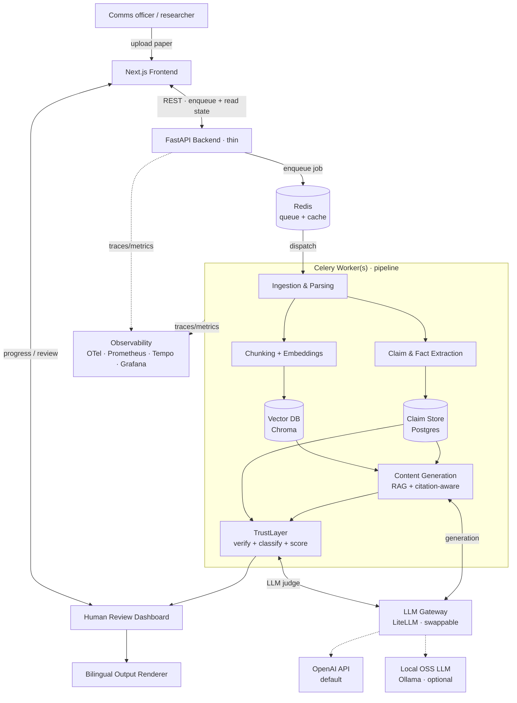
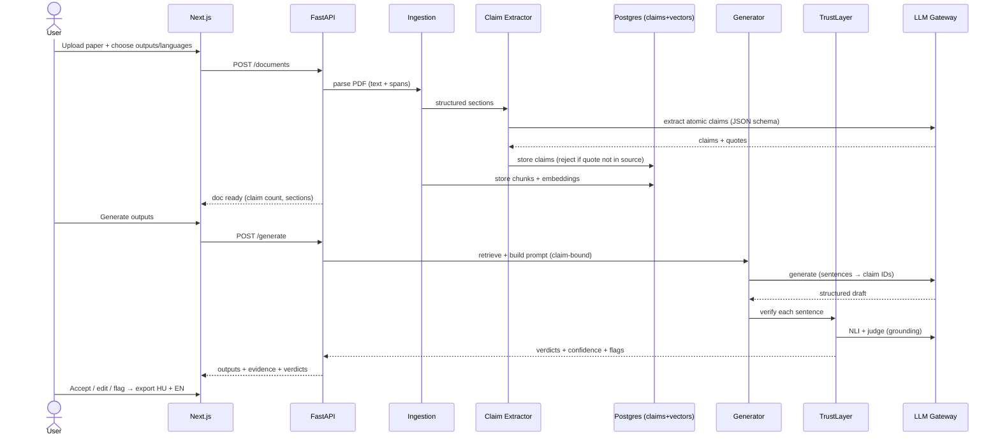
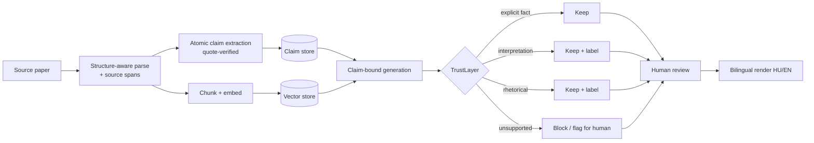
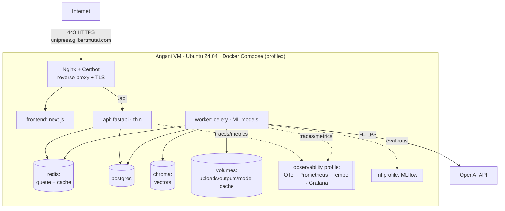

# UniPress DE — System Architecture

> **DEIK.AI Challenge 2026 · Category 2.C** · Companion to [`01-project-definition.md`](01-project-definition.md)
> Build mode: Solo · LLM strategy: Hybrid (OSS core + swappable hosted LLM) · Deploy: Docker Compose

---

## 0. Design principles

Every choice below serves five constraints, in priority order:

1. **Trustworthy output** — the system's whole reason to exist is verifiable, evidence-linked content. Architecture optimizes for traceability first, cleverness second.
2. **Demoable in 3 minutes** — the happy path (paper in → verified outputs out, with evidence side-by-side) must be fast and visually legible.
3. **Production-grade, solo-scoped** — built as the first slice of a real system (async workers, observability, migrations, CI/CD), not a throwaway prototype; scope is controlled by deferring features, not by cutting engineering rigor.
4. **Locally deployable** — supports the "data protection / on-prem" narrative; nothing hard-wired to a single vendor.
5. **Observable & reproducible from day one** — metrics, traces, structured logs, versioned migrations, and tracked eval runs are built in, because retrofitting them is expensive and they are the builder's engineering strength.

**North-star rule:** *No claim reaches the final output without a source span attached to it.* This is enforced structurally, not by prompt-hoping.

---

## 1. High-level architecture

**Plain English:** A user uploads a paper through the Next.js UI. The **API stays thin** — it validates the request, enqueues a job on **Redis**, and returns immediately; the frontend tracks progress. A **Celery worker** runs the pipeline: the paper is parsed, its factual claims are extracted into a **Claim Store** (each with a source span), and its text is chunked and embedded into a **Vector DB**. When outputs are requested, the **Generation** stage produces content grounded in retrieved chunks and the claim store. **TrustLayer** then checks every generated sentence against the source, classifies it, and scores confidence. The result goes to a **Review Dashboard** where the officer accepts/edits/flags, and the **Output Renderer** produces the bilingual deliverables. A single **LLM Gateway** abstracts the model provider. Every service emits **traces and metrics** to the observability stack. Running the heavy work on workers (not in the request thread) is what lets the system stay responsive and recover from failures — a deliberate production choice, detailed in §2.14.

---

## 2. Component architecture

For each component: **purpose · why needed · recommended tech · alternatives · trade-offs**. Components deliberately scoped out are listed in §7 (Deliberate exclusions).

### 2.1 Frontend — Review & Demo UI
- **Purpose:** Upload a paper, trigger generation, and — the money shot — show each generated claim next to its source evidence, with accept/edit/flag controls.
- **Why needed:** The human-in-the-loop review *is* the product's trust story and the demo's centerpiece. A CLI can't sell this.
- **Recommended:** **Next.js + React + Tailwind** (your stack). Server-side calls to FastAPI.
- **Alternatives:** Streamlit/Gradio (faster to build, weaker UX, less credible on video); plain SPA.
- **Trade-offs:** Next.js costs more time than Streamlit but produces the polished, split-view evidence UI that wins on camera. Worth it.

### 2.2 API / Orchestration — FastAPI
- **Purpose:** Coordinate the pipeline, expose REST endpoints, manage jobs.
- **Why needed:** Central control plane; clean seam between UI and AI.
- **Recommended:** **FastAPI + Pydantic v2** (typed contracts everywhere — critical for structured outputs).
- **Alternatives:** Flask (less async/typing), Node/Nest (splits your AI code from Python ecosystem — avoid).
- **Trade-offs:** FastAPI async + Pydantic gives typed, validated structured outputs for free — directly supports the anti-hallucination design.

### 2.3 Ingestion & Structure-aware Parsing
- **Purpose:** PDF → clean, structured text with **positional metadata** (page, section, bounding box) so claims can point back to exact locations.
- **Why needed:** Evidence-linking is impossible without knowing *where* text came from. This is foundational, not optional.
- **Recommended:** **Docling** (IBM, OSS) or **PyMuPDF (fitz)** for layout + coordinates; **GROBID** for scientific-PDF structure (title/abstract/sections/references) if we need robust academic parsing.
- **Alternatives:** unstructured.io (heavier), pdfplumber (tables good, layout weaker), raw pypdf (no layout).
- **Trade-offs:** GROBID is purpose-built for papers and gives excellent section/reference structure but adds a Java service. Start with PyMuPDF/Docling; add GROBID if section detection is weak. **OCR (Tesseract) deferred** — assume born-digital PDFs for MVP.

### 2.4 Claim & Fact Extraction
- **Purpose:** Turn the paper into a list of atomic **claims**, each with `{text, type, source_span}`. This is the knowledge representation.
- **Why needed:** The differentiator. Generation is constrained to these claims; TrustLayer verifies against them. Without it we're just another summarizer.
- **Recommended:** **LLM-based extraction with a strict JSON schema** (via the gateway), each claim tagged with the supporting quote + offsets. Store atomic, checkable statements.
- **Alternatives:** Pure OpenIE / spaCy triples (brittle on scientific prose); rule-based (won't generalize).
- **Trade-offs:** LLM extraction is flexible but must be schema-constrained and validated (reject claims whose quote isn't found in the source text — a cheap, powerful guardrail).

### 2.5 Claim Store (structured knowledge)
- **Purpose:** Canonical record of every claim + provenance; the join key between generation and verification.
- **Why needed:** Provenance must be queryable and durable, not held in a prompt.
- **Recommended:** **PostgreSQL** (JSONB for spans) for relational data + provenance; vectors live separately in Chroma (§2.7).
- **Alternatives:** SQLite (fine for MVP, but Postgres has a cleaner production story); a graph DB (overkill now).
- **Trade-offs:** Postgres slightly heavier than SQLite but is the durable, queryable home for claims/spans/metrics and a natural production path.

### 2.6 Chunking + Embeddings
- **Purpose:** Make the paper retrievable for RAG.
- **Why needed:** Generation and verification both retrieve supporting passages.
- **Recommended:** Section-aware chunking (respect the parsed structure); embeddings via **BGE-m3** or **multilingual-e5** (both strong, **multilingual → supports HU + EN**).
- **Alternatives:** OpenAI/Cohere embeddings (quality, but breaks "local" story), naive fixed-size chunking (loses structure).
- **Trade-offs:** Multilingual OSS embeddings keep the local-deployability narrative intact and handle both languages with one model.

### 2.7 Vector Database
- **Purpose:** Semantic retrieval of chunks.
- **Why needed:** Core of RAG.
- **Recommended:** **Chroma** (dedicated vector store, run as its own service or in persistent mode).
- **Why:** The builder has prior hands-on Chroma experience — for a solo build against a deadline, familiarity lowers delivery risk and speeds iteration. Open-source, local, clean Python API with metadata filtering.
- **Alternatives:** pgvector (keeps everything in one Postgres service, but a new tool for the builder); Qdrant (excellent, no prior experience). 
- **Trade-offs:** Adds a second data service alongside Postgres — accepted, because the confidence/speed gain from a known tool outweighs the extra container on a solo timeline. Retrieval accesses vectors through a thin `VectorStore` interface, so a later swap to Qdrant is an adapter change, not a rewrite.

### 2.8 Content Generation (RAG, citation-aware)
- **Purpose:** Produce each output type (press release, article, social, exec summary, video script) grounded in retrieved chunks + claim store, emitting **structured output where each sentence carries claim IDs**.
- **Why needed:** The generator; audience-adaptive rendering of verified facts.
- **Recommended:** LLM via gateway with **per-output-type prompt templates + JSON schema** binding sentences → claim IDs. Retrieval provides context; claim store constrains facts.
- **Alternatives:** Free-form generation then post-hoc citation matching (weaker linkage); fine-tuned model (out of scope for MVP — revisit for Sprint).
- **Trade-offs:** Structured, claim-bound generation is more prompt engineering up front but makes verification tractable and evidence-linking native.

### 2.9 TrustLayer — Verification, Classification, Scoring
- **Purpose:** For every generated sentence: (a) retrieve its cited source span, (b) check entailment (does the source actually support it?), (c) classify as *explicit fact / reasonable interpretation / rhetorical framing / unsupported*, (d) assign a confidence score. Block or flag unsupported claims.
- **Why needed:** This is the soul of the project and the credibility play for an academic jury.
- **Recommended:** **Two-tier check** — (1) fast NLI model (e.g. a fine-tuned DeBERTa-MNLI or `bge-reranker` grounding score) for entailment; (2) LLM-as-judge for classification + edge cases. Combine into a confidence score. Also run **claim-coverage** (did we omit important facts?).
- **Alternatives:** LLM-only judging (simpler, but slower/pricier and less defensible); metric-only (RAGAS faithfulness) — good for eval, thin for per-sentence UX.
- **Trade-offs:** Two-tier balances cost/latency/rigor and gives a defensible, explainable verdict per sentence. This is where to spend engineering depth.

### 2.10 Human Review Dashboard
- **Purpose:** Present outputs with per-sentence verdicts + evidence; let the officer accept/edit/flag; capture decisions (also = eval data + the "human satisfaction" metric).
- **Why needed:** Human-in-the-loop is both a trust guarantee and a demo highlight.
- **Recommended:** Part of the Next.js app; split view (generated text ↔ highlighted source).
- **Trade-offs:** Building the evidence-linked UI well is time-consuming but is literally the winning demo moment.

### 2.11 Bilingual Output Renderer
- **Purpose:** Produce final HU + EN deliverables in clean formats (Markdown/HTML/PDF; video script as timed text).
- **Why needed:** The tangible product.
- **Recommended:** Template-based rendering (Jinja2 → Markdown/HTML; WeasyPrint for PDF). Generate per language with the same claim constraints (not blind machine translation — regenerate constrained to claims in the target language).
- **Trade-offs:** Regenerate-per-language costs more calls but preserves factual fidelity across languages (a genuine differentiator vs. translate-after-the-fact).

### 2.12 LLM Gateway (swappable model layer)
- **Purpose:** Single abstraction over generation + judging models; config-driven choice of hosted vs. local.
- **Why needed:** The hybrid strategy depends on this; also enables cost/latency control and prevents vendor lock-in.
- **Recommended:** **LiteLLM** to unify APIs; **OpenAI (GPT-4o/GPT-4.1)** for quality by default, **Ollama / vLLM** for optional local OSS models.
- **Alternatives:** Hard-code one provider (kills the hybrid narrative — avoid).
- **Trade-offs:** A small abstraction cost now buys the entire "locally deployable, no lock-in" story and easy A/B of models in eval.

### 2.13 Observability & Evaluation
- **Purpose:** Trace every stage across API and workers; expose latency, LLM token cost, cache hit rate, and queue depth as metrics; surface **live eval signals** (hallucination rate, faithfulness, coverage) as first-class series; keep structured, trace-correlated logs.
- **Why needed:** Operability is a core engineering competency — you cannot run or trust what you cannot measure. It also makes the evaluation story *visible*: a Grafana board is one of the strongest demo assets for a technical jury.
- **Recommended:** **OpenTelemetry** instrumentation → **OTel Collector** → **Prometheus** (metrics) + **Tempo** (traces), visualized in **Grafana**; **structlog** JSON logs (optionally to **Loki**); **MLflow** for versioned eval runs.
- **Trade-offs:** Adds several infra containers, isolated behind a Compose `observability` profile so lightweight local runs can opt out. Included from day one — retrofitting observability is expensive and it is the builder's DevOps strength.

### 2.14 Async processing — Job queue + workers
- **Purpose:** Run ingestion → parsing → claim extraction → embedding → verification as a **Celery task chain** on dedicated workers, so multi-second/minute ML and LLM work never blocks a request thread.
- **Why needed:** Synchronous request-time processing is a production anti-pattern — it collapses under concurrency, has no retry story, and loses work on crashes. A queue provides retries, idempotency, concurrency control, backpressure, crash recovery, and horizontal worker scaling. This is the clearest structural signal that the system is engineered for real use.
- **Recommended:** **Celery** (broker/result backend = **Redis**, which also serves as a memoization cache); **Flower** for live queue/worker visibility. Task chain with per-stage retries and idempotency keys.
- **Alternatives:** **Arq** (async-native, lighter) or **RQ**; Celery chosen for maturity, ecosystem, and recognizability. Task dispatch sits behind a small interface, so the engine is swappable.
- **Trade-offs:** Adds a worker container + Redis; accepted as correct architecture. The API becomes thin (enqueue + read state), which also improves testability and horizontal scaling.

---

## 3. Data flow (request lifecycle)

---

## 4. AI pipeline (the trust-critical path)

**Hallucination controls, layered (defense in depth):**
1. **Extraction guardrail** — reject any claim whose supporting quote isn't literally found in the source.
2. **Claim-bound generation** — the model writes *from* the claim store, not from memory.
3. **Structured sentence→claim binding** — every sentence must cite a claim ID or be marked rhetorical.
4. **TrustLayer entailment check** — NLI verifies the cited span actually supports the sentence.
5. **Classification + confidence** — unsupported/low-confidence content is blocked or flagged.
6. **Human review** — final gate, and the decisions feed evaluation.

---

## 5. Deployment architecture

> Full profiled topology (Flower, optional Ollama/GROBID, volumes) in [`07-tech-stack.md`](07-tech-stack.md) §9.3.

- **MVP (local dev):** `docker compose up` brings the whole system up on one machine — dev/prod parity.
- **Competition (deployed):** the **same compose stack on an Angani cloud VM** (8 vCPU / 16 GB / 100 GB, Ubuntu 24.04), fronted by **Nginx + Certbot** for HTTPS, reachable at a **`gilbertmutai.com` subdomain**. Nothing runs on the presenter's laptop — judges can open the URL themselves. Full details in [`07-tech-stack.md`](07-tech-stack.md) §9.
- **Production:** Kubernetes + Terraform (builder's strengths), managed Postgres, Qdrant, autoscaled model serving (vLLM), object storage. **Deferred — not built for the competition.**

---

## 6. Security & data-handling architecture

- **Secrets:** `.env` (git-ignored) on the server → env vars; the **OpenAI API key**, DB credentials, etc. never in code or the image. Production: a secrets manager.
- **Network isolation:** only Nginx (80/443) and SSH (22, restricted) are exposed; Postgres/Chroma stay on the internal Docker network, never published to the internet.
- **Data minimization / privacy:** documents processed on the VM; the optional **local Ollama inference path** keeps sensitive/unpublished inputs off any external API — a concrete privacy story for the jury (default path sends text to OpenAI).
- **Licensing safety:** primary corpus = the organizers' CC BY 4.0 sample papers + UD's own curricula (see [`06-dataset-strategy.md`](06-dataset-strategy.md)); uploads are user-owned; no PDFs committed (see `.gitignore`); attribution shown on outputs; provenance stored per document.
- **Input safety:** validate file type/size; treat PDF text as untrusted; guard against prompt-injection embedded in documents (system prompts isolate source text; TrustLayer catches injected "facts" with no grounding).
- **Auditability:** every output carries its evidence trail + model/version used — reproducibility and accountability.

---

## 7. Deliberate exclusions (scoped out, on purpose)

*Only include what's justified* — but note the bar is "engineered for production," not "minimal MVP." What we deliberately defer, with rationale:

| Excluded | Why not now | When to add |
|---|---|---|
| OCR (Tesseract/PaddleOCR) | Sample corpus is born-digital; OCR is a rabbit hole | If scanned docs matter (Sprint) |
| Qdrant / HA vector infra | Chroma is right-sized for demo scale (builder-proven); swap is an adapter | Multi-tenant/HA corpus (production) |
| Fine-tuning / QLoRA | Prompt + RAG + verification suffices; train only against a measured gap | If eval shows a specific gap (Sprint) |
| Full video *rendering* (TTS + assembly) | High effort, low marginal jury value vs. a strong script | Stretch module / Sprint |
| Kubernetes + Terraform + Helm | Compose (profiled) is correct for one node; K8s is the documented graduation, not premature ops | Production / multi-node |
| self-hosted vLLM cluster | OpenAI via gateway meets quality now; Ollama covers the local demo | Production model serving |
| Multi-document / cross-paper synthesis | Single-paper is a cleaner, stronger demo | Sprint feature |
| Auth / multi-user / SSO | Single-officer demo; adds no jury value yet | Production |

**Included and built** (not deferred, because they define production-grade): async job queue (Celery/Redis), full observability (OTel/Prometheus/Tempo/Grafana), MLflow eval tracking, Alembic migrations, CI/CD with an eval gate. These are table stakes for an experienced engineer, not extras.

**Video note:** MVP delivers a polished **video script** (timed, scene-by-scene). Actual video generation (TTS voiceover + captioned assembly) is a clearly-scoped *stretch* module — impressive on camera, but never at the expense of the trust core.

---

## 8. Competition / Production split (summary)

The competition build *is* the first slice of the production system — there is no throwaway tier.

| Capability | Competition (built) | Production (graduation) |
|---|:--:|:--:|
| PDF parse + spans | ✅ | + OCR |
| Claim extraction (quote-verified) | ✅ | ✅ |
| RAG generation (claim-bound) | ✅ | ✅ |
| TrustLayer (NLI + judge + score) | ✅ | fine-tuned NLI |
| Evidence-linked review UI | ✅ | + auth/multi-tenant |
| Outputs: press/article/social/exec/script | ✅ | ✅ |
| Bilingual HU + EN | ✅ | + more languages |
| Async job queue (Celery/Redis) | ✅ | autoscaling / KEDA |
| Evaluation harness + MLflow | ✅ | eval as CD gate |
| Observability (OTel/Prom/Tempo/Grafana) | ✅ | + Loki, alerting, SLOs |
| CI/CD (lint/type/test/eval/build/deploy) | ✅ | + canary/rollback |
| LLM via gateway (OpenAI + Ollama) | ✅ | + self-hosted vLLM |
| Migrations (Alembic) | ✅ | CI-gated |
| Video rendering | stretch | ✅ |
| Deploy | Compose (profiles) on VM + Nginx/Certbot | K8s + Terraform |

---

## 9. Open decisions to resolve in the Tech Stack phase

1. Parser: PyMuPDF/Docling alone vs. + GROBID (decide after testing on 3–5 real papers).
2. Embedding model: BGE-m3 vs. multilingual-e5 (bench on HU + EN retrieval).
3. NLI model choice + threshold for the TrustLayer entailment tier.
4. Hosted LLM provider for the generation tier (quality vs. cost) via the gateway.
5. Confidence-score formula (how NLI + judge combine into one number).

## Next phase

**AI Pipeline & Anti-Hallucination Design** (`03-ai-pipeline.md`) — deep dive on claim extraction schema, the sentence↔claim binding format, and the exact TrustLayer verdict/scoring algorithm.
