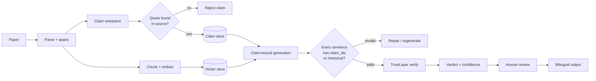
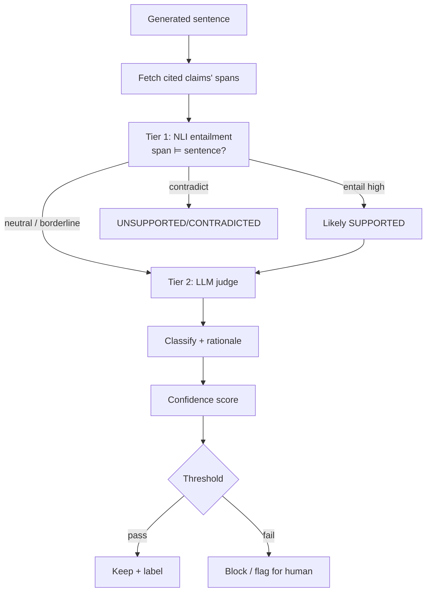

# UniPress DE — AI Pipeline & Anti-Hallucination Design

> **DEIK.AI Challenge 2026 · Category 2.C** · Companion to [`02-architecture.md`](02-architecture.md)
> The trust-critical path in detail: data contracts, extraction, generation binding, and the TrustLayer algorithm.

---

## 0. The core idea in one sentence

Instead of asking an LLM to "write a press release about this paper" (opaque, unverifiable), we **decompose the paper into atomic, quote-anchored claims**, **generate content that is structurally bound to those claims**, and then **independently verify every generated sentence against its cited evidence** — so trust is a property of the data model, not a hope about the prompt.



---

## 1. Data contracts (the backbone)

Everything downstream depends on these Pydantic models. They are the API between stages and the guarantee of traceability.

### 1.1 `SourceSpan` — where something lives in the paper
```python
class SourceSpan(BaseModel):
    doc_id: str
    page: int                 # 1-indexed
    section: str | None       # e.g. "Results", "3.2 Ablations"
    char_start: int           # offset into the section's normalized text
    char_end: int
    quote: str                # the exact supporting text, verbatim
    bbox: list[float] | None  # [x0,y0,x1,y1] for UI highlight (if available)
```

### 1.2 `Claim` — an atomic, checkable statement
```python
class Claim(BaseModel):
    id: str                          # "clm_001"
    text: str                        # atomic, self-contained, no pronouns
    claim_type: ClaimType            # see §2.2
    span: SourceSpan                 # provenance (quote-verified)
    entities: list[str] = []         # normalized key terms (for retrieval/coverage)
    importance: float = 0.5          # 0–1, used for coverage weighting
    numeric: bool = False            # contains a number/statistic (higher scrutiny)
```

### 1.3 `GeneratedSentence` — one unit of output, bound to evidence
```python
class GeneratedSentence(BaseModel):
    text: str
    claim_ids: list[str]             # claims this sentence asserts ([] only if rhetorical)
    role: SentenceRole               # FACT | INTERPRETATION | RHETORICAL | TRANSITION
    # filled by TrustLayer:
    verdict: Verdict | None = None
    confidence: float | None = None
```

### 1.4 `Output` — a full deliverable
```python
class Output(BaseModel):
    output_type: OutputType          # PRESS_RELEASE | ARTICLE | SOCIAL | EXEC_SUMMARY | VIDEO_SCRIPT
    language: Literal["en", "hu"]
    title: str
    sentences: list[GeneratedSentence]
    coverage: CoverageReport         # which important claims were used/omitted
    quality: QualityScore | None     # aggregate from evaluation
```

**Why this shape wins:** the UI can render any sentence with its evidence by dereferencing `claim_ids → Claim.span → quote/bbox`. Nothing is free-floating.

---

## 2. Stage 1 — Claim & Fact Extraction

### 2.1 Objective
Convert the parsed paper into a set of **atomic** claims. Atomic = one assertion, self-contained (no "it/this/they"), independently checkable.

> Bad: *"It improved the results significantly by using the new method on both datasets."*
> Good (split):
> - *"The proposed method improved F1 score by 4.2 points on Dataset A."*
> - *"The proposed method improved F1 score on Dataset B."*

### 2.2 Claim types (the trust taxonomy)
| Type | Meaning | Example |
|---|---|---|
| `EXPLICIT_FACT` | Stated directly in the source | "Accuracy reached 92.1%." |
| `QUANTITATIVE` | A fact containing a number/stat (extra scrutiny) | "Trained on 1.2M images." |
| `FINDING` | The paper's own conclusion/claim | "The method outperforms baselines." |
| `METHOD` | What was done | "A transformer encoder was used." |
| `LIMITATION` | Stated caveat/constraint | "Results are limited to English text." |
| `BACKGROUND` | Context/prior work | "Prior methods rely on manual features." |

Storing limitations explicitly lets the generator **communicate responsibly** (and impresses a research jury — most tools bury caveats).

### 2.3 Extraction method — schema-constrained LLM + hard guardrail
1. Feed each section's text to the LLM with a **strict JSON schema** (via the gateway; Pydantic-validated).
2. Require each claim to include its **verbatim `quote`**.
3. **Guardrail (non-negotiable):** normalize whitespace and check `quote ∈ section_text`. If the quote is not literally present → **reject the claim** (it's a hallucinated extraction). Log the rejection rate as a health metric.
4. Compute `char_start/char_end` by locating the accepted quote; attach `bbox` from the parser if available.
5. Deduplicate near-identical claims (embedding cosine > 0.95).

### 2.4 Why not pure NLP triples (OpenIE/spaCy)?
Brittle on scientific prose, poor at multi-clause findings, no notion of claim type. LLM extraction + the quote guardrail gives flexibility *and* verifiability. Trade-off documented in [`02-architecture.md`](02-architecture.md) §2.4.

---

## 3. Stage 2 — Retrieval

Two consumers, two retrieval modes:
- **Generation context:** hybrid retrieval (dense pgvector + lexical/BM25) over chunks, plus the full claim list for the requested angle. Rerank top-k with `bge-reranker` if needed.
- **Verification context (TrustLayer):** given a generated sentence's `claim_ids`, fetch those claims' spans directly (no fuzzy search) — verification checks the *cited* evidence, not merely *some* evidence. This distinction is what makes the check honest.

---

## 4. Stage 3 — Claim-bound Generation

### 4.1 Contract
The generator receives: `{output_type, language, audience_profile, selected_claims[], retrieved_context[]}` and must return `Output` where **every `GeneratedSentence` either lists ≥1 `claim_ids` or is explicitly `role=RHETORICAL/TRANSITION`**.

### 4.2 Prompt strategy (per output type)
- System prompt: role + hard rules ("Every factual sentence must reference claim IDs from the provided list. Do not introduce facts, numbers, or names not present in the claims. Mark connective/framing sentences as RHETORICAL.").
- The claim list is injected as `[clm_001] <text>` lines; the model cites IDs.
- Output constrained to the `Output` JSON schema (structured outputs / tool-calling).
- Audience/tone/length parameters come from the per-output spec (next doc, `04-content-outputs.md`).

### 4.3 Bilingual handling
**Regenerate per language, constrained to the same claims** — not translate-after-the-fact. Each language run cites the same `claim_ids`, so evidence links hold across HU and EN. (Rationale: preserves factual fidelity; see architecture §2.11.)

### 4.4 Self-repair loop
If schema validation fails or a sentence lacks `claim_ids` while marked FACT → one automatic repair pass with the specific violation fed back. Max 2 attempts, then flag for human. (Cheap reliability win; bounded cost.)

---

## 5. Stage 4 — TrustLayer (the differentiator)

For **each** `GeneratedSentence` with `role ∈ {FACT, INTERPRETATION}`:



### 5.1 Tier 1 — NLI entailment (fast, cheap, deterministic)
- Model: a DeBERTa-v3-MNLI-style cross-encoder (OSS, runs local).
- Input: `premise = concatenated cited spans`, `hypothesis = sentence`.
- Output: `P(entail)`, `P(neutral)`, `P(contradict)`.
- Rules:
  - `P(contradict) > 0.5` → **CONTRADICTED** (hard fail, always flag).
  - `P(entail) > τ_high (≈0.85)` and not numeric → **SUPPORTED** (may skip Tier 2 to save cost).
  - Numeric/`QUANTITATIVE` claims → **always** go to Tier 2 (numbers are the #1 hallucination risk).
  - otherwise → Tier 2.

### 5.2 Tier 2 — LLM-as-judge (nuanced, explainable)
- Prompt: "Given SOURCE (cited spans) and STATEMENT, decide: is the statement fully supported, a reasonable interpretation, unsupported, or contradicted? For numbers, verify the exact value. Return {label, supported_fraction, rationale, offending_text?}."
- Structured output; the `rationale` is shown in the review UI (explainability = jury points).
- Use the gateway; can run on hosted (quality) or local (privacy) model.

### 5.3 Verdict taxonomy (what the user sees per sentence)
| Verdict | Meaning | UI treatment |
|---|---|---|
| `SUPPORTED` | Source directly entails it | green, evidence on hover |
| `INTERPRETATION` | Reasonable inference, not literal | amber "interpretation" tag |
| `RHETORICAL` | Framing/connective, no factual load | grey, no evidence needed |
| `UNSUPPORTED` | No grounding found | red, blocked from export by default |
| `CONTRADICTED` | Source says otherwise | red, hard-flagged |

### 5.4 Confidence score (single number, explainable)
For a factual sentence:

```
confidence = w1 * P_entail            # Tier-1 entailment prob
           + w2 * judge_supported     # Tier-2 supported_fraction (0–1)
           + w3 * quote_overlap       # lexical overlap of numbers/entities with span
           - penalty_numeric_mismatch # hard penalty if a number differs from source
```
- Default weights `w1=0.4, w2=0.4, w3=0.2` (tunable in eval).
- `penalty_numeric_mismatch` forces confidence low whenever any number in the sentence ≠ a number in the cited span — this single rule kills the most damaging failure mode.
- Export threshold default `≥ 0.7`; below → flagged for human. Thresholds are config, tuned against the eval set (`05-evaluation.md`).

### 5.5 Document-level checks (beyond per-sentence)
- **Coverage:** of the top-N `importance`-weighted claims, how many made it into the output? Report omissions (esp. omitted `LIMITATION`s → warn: "caveat dropped").
- **Consistency:** no two kept sentences contradict each other (pairwise NLI on flagged pairs only).

---

## 6. Handling the hard cases (your brief's checklist)

| Situation | Strategy |
|---|---|
| **Tables** | Parser extracts table cells with coordinates; numeric claims cite the cell; TrustLayer's numeric check compares exact values. |
| **Scanned PDFs** | Out of MVP scope (OCR deferred); detect image-only pages and warn the user rather than silently failing. |
| **Conflicting info in the paper** | Both claims stored; if generation uses one, consistency check surfaces the tension; UI shows both spans. |
| **Missing information** | The model may only use provided claims; if asked for something absent, it must return an explicit "not stated in source" rather than invent — enforced by the no-new-facts rule + coverage report. |
| **Unsupported claims** | Blocked from export by default; shown in red with the reason; human can override with an explicit note (logged). |
| **Prompt injection in the PDF** | Source text is passed as data, never as instructions; any "fact" injected via the document still has no genuine grounding span → caught by TrustLayer. |

---

## 7. Cost & latency budget (per paper, MVP target)

| Stage | LLM calls | Rough latency | Notes |
|---|---|---|---|
| Extraction | ~1 per section | 5–20 s | batched; cached per doc |
| Generation | 1 per (output × language) | 3–8 s each | parallelizable |
| TrustLayer T1 | 0 LLM (local NLI) | <1 s / sentence | cheap, runs always |
| TrustLayer T2 | only borderline + numeric | 1–3 s each | cost-controlled by Tier-1 gating |

**Design lever:** Tier-1 gating means most sentences never hit an LLM in verification — keeps cost/latency demo-friendly while numbers still get full scrutiny.

---

## 8. What we're deliberately NOT doing here (and why)

- **No fine-tuning for extraction/judging in MVP** — schema-constraint + guardrail + NLI is enough; revisit only if eval shows a specific, repeatable gap.
- **No knowledge-graph store** — atomic claims in Postgres cover provenance and coverage without graph complexity.
- **No agentic multi-hop reasoning** — single-paper scope keeps the pipeline deterministic and demoable; multi-doc synthesis is a Sprint feature.

---

## 9. Open parameters to tune during evaluation

1. NLI thresholds `τ_high`, contradiction cutoff.
2. Confidence weights `w1/w2/w3` and export threshold.
3. Chunk size / overlap and reranker on/off.
4. When to skip Tier 2 (aggressiveness of gating) — cost vs. rigor.
5. Claim `importance` scoring method (LLM-assigned vs. position/section heuristic).

## Next phase

**Content Generation Spec** (`04-content-outputs.md`) — for each of the 5 output types: input, target audience, tone, length, structure, and factual constraints; plus the audience-adaptation matrix.
