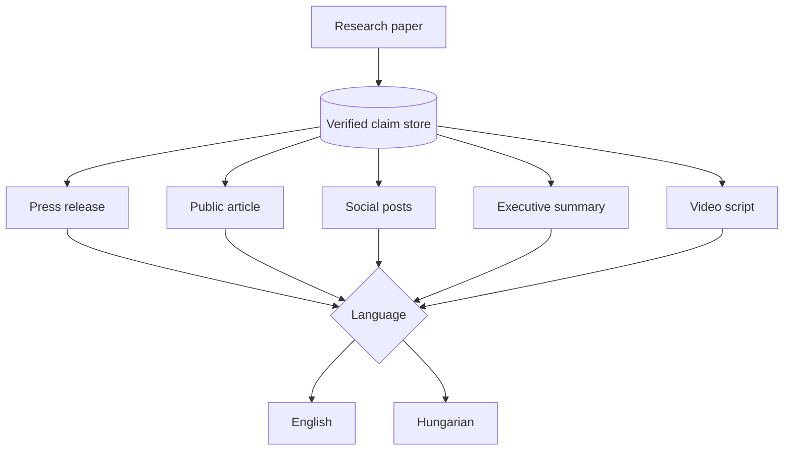

# UniPress DE — Content Generation Spec

> **DEIK.AI Challenge 2026 · Category 2.C** · Companion to [`03-ai-pipeline.md`](03-ai-pipeline.md)
> The five output types, their specs, and how one verified claim set fans out to many audiences without losing factual fidelity.

---

## 0. The fan-out principle

One paper is extracted **once** into a verified claim store. Each output type then *renders* those same claims for a different audience — same facts, different framing, length, and tone. Nothing new is invented per output; only presentation changes.



**Contract for every output:** each factual sentence cites `claim_ids`; TrustLayer verifies each; omitted `LIMITATION` claims trigger a warning; export blocked if any `UNSUPPORTED`/`CONTRADICTED` sentence remains unresolved.

---

## 1. Shared generation parameters

Every output is generated from a common parameter block, specialized per type:

```python
class OutputSpec(BaseModel):
    output_type: OutputType
    language: Literal["en", "hu"]
    audience: AudienceProfile     # who reads it (see §7)
    tone: str                     # e.g. "authoritative, accessible"
    length_target: LengthTarget   # words / chars / duration
    structure: list[str]          # ordered sections the generator must fill
    must_include: list[str]       # e.g. ["headline finding", "who", "why it matters"]
    must_avoid: list[str]         # e.g. ["jargon", "unverified numbers", "hype"]
    claim_filter: ClaimFilter     # which claim_types are eligible (see per-type)
    reading_level: str            # target readability (see §8)
```

The `claim_filter` is a quiet but important control: a press release may draw on `FINDING`, `QUANTITATIVE`, `LIMITATION`; a social post might use only the single highest-`importance` `FINDING`.

---

## 2. Press Release

- **Input:** verified claims (prioritized: headline `FINDING`, key `QUANTITATIVE`, one `LIMITATION`, institutional/author context), publication metadata.
- **Target audience:** journalists, general public, institutional stakeholders.
- **Tone:** authoritative, newsworthy, accessible — no hype, no unverifiable superlatives.
- **Length:** 350–500 words.
- **Structure (must fill in order):**
  1. **Headline** — the finding as a clear, non-sensational claim.
  2. **Dateline + lead** — who/what/where/why-it-matters in the first sentence.
  3. **Body** — 2–3 paragraphs: the finding, how it was done (plain terms), why it matters.
  4. **Quote slot** — a placeholder attributed quote (marked as human-supplied; never fabricated).
  5. **Caveat/limitation** — one honest sentence (from a `LIMITATION` claim).
  6. **Boilerplate** — institution/contact (template, not generated).
- **Factual constraints:** every number traces to a `QUANTITATIVE` claim; the headline must be entailed by a `FINDING`; the attributed quote is a **template placeholder** the human fills (the system never invents human quotes).

> **Journalist-quote rule:** the system may *draft* a quote only if explicitly requested, and it is hard-flagged `REQUIRES_HUMAN_APPROVAL` and never auto-exported. Default = empty placeholder.

## 3. Public-facing Article

- **Input:** broader claim set incl. `BACKGROUND` and `METHOD` (simplified).
- **Target audience:** curious non-experts (educated public, prospective students).
- **Tone:** engaging, explanatory, warm but accurate.
- **Length:** 600–900 words.
- **Structure:** hook → why this problem matters → what the researchers did (analogy-friendly) → what they found → what it could mean → honest limits → where to learn more.
- **Factual constraints:** analogies allowed but must be marked `role=RHETORICAL` (not factual claims); simplifications must not change the meaning of a cited claim (TrustLayer INTERPRETATION check applies).

## 4. Social Media Posts

- **Input:** the 1–3 highest-`importance` `FINDING`/`QUANTITATIVE` claims.
- **Target audience:** platform-specific publics.
- **Variants:**
  | Platform | Length | Style |
  |---|---|---|
  | LinkedIn | 80–150 words | professional, 1 insight + why-it-matters + link |
  | X/Twitter | ≤280 chars | punchy, 1 claim, 1–2 hashtags |
  | Instagram/FB caption | 60–120 words | accessible, human interest |
- **Factual constraints:** the single asserted fact must be `SUPPORTED` with confidence ≥ export threshold; no numbers unless from a `QUANTITATIVE` claim; hashtags are `RHETORICAL`. Emoji optional, off by default.

## 5. Executive Summary

- **Input:** `FINDING`, `QUANTITATIVE`, `LIMITATION`, `METHOD` (condensed).
- **Target audience:** decision-makers, funders, deans, department heads.
- **Tone:** concise, neutral, decision-oriented.
- **Length:** 150–250 words, often bulleted.
- **Structure:** one-line takeaway → context (1 sentence) → key results (bullets, each cited) → implications → limitations/next steps.
- **Factual constraints:** highest scrutiny on numbers; **no** rhetorical framing (this audience wants signal); coverage report must show all high-importance findings included or explicitly note exclusions.

## 6. Video Script (≤60s)

- **Input:** the single narrative arc — 1 hook, 2–3 key claims, 1 takeaway.
- **Target audience:** social video viewers (short attention, high reach).
- **Tone:** energetic, clear, spoken-word cadence.
- **Length:** ~130–150 spoken words (≈60s at ~140 wpm).
- **Structure (scene-by-scene, timed):**
  ```
  [0:00–0:05] HOOK      — question or striking finding (cited)
  [0:05–0:20] CONTEXT   — the problem, plain language
  [0:20–0:45] FINDING   — what they discovered (cited claims)
  [0:45–0:55] MEANING   — why it matters
  [0:55–1:00] CTA       — where to learn more
  ```
  Each scene includes: **narration** (spoken), **on-screen text** (short), **visual suggestion** (e.g. "show Figure 2"), and **claim_ids**.
- **Factual constraints:** on-screen numbers must match `QUANTITATIVE` claims exactly; visual suggestions referencing figures must cite the figure's span; narration verified like any factual text.
- **Output format:** structured JSON (scenes) → rendered as a readable script table. (Actual TTS/video assembly is the **stretch module**, per architecture §7.)

---

## 7. Audience-adaptation matrix

The same finding, rendered five ways — this table is the demo's "aha" and a good slide.

| Dimension | Press release | Public article | Social | Exec summary | Video script |
|---|---|---|---|---|---|
| **Reader** | Journalist/public | Curious non-expert | Platform public | Decision-maker | Video viewer |
| **Length** | 350–500 w | 600–900 w | ≤280 ch – 150 w | 150–250 w | ~140 spoken w |
| **Tone** | Newsworthy | Explanatory | Punchy | Neutral/decisive | Energetic |
| **Jargon** | Low | Low + analogy | None | Low (precise) | None |
| **Numbers** | Key ones | Few, contextual | ≤1 headline | All key, precise | 1–2 on-screen |
| **Rhetorical allowed** | Some | Yes (analogies) | Yes (hashtags) | No | Yes (hook) |
| **Claim types used** | FINDING, QUANT, LIMIT | +BACKGROUND, METHOD | Top FINDING | FINDING, QUANT, LIMIT | Narrative arc |
| **Primary risk** | Overclaim | Oversimplify | Context loss | Omission | Number on screen |

### Worked example (illustrative)
> **Source claim** `clm_014` (QUANTITATIVE): *"The model reduced diagnosis time by 37% compared to the manual baseline."* [p.6, Results]
>
> - **Press:** "A new AI method cut diagnosis time by more than a third in laboratory testing, researchers report."
> - **Article:** "Imagine getting results in two-thirds of the time — that's roughly what the team achieved, a 37% reduction compared with the usual manual process."
> - **Social (X):** "New AI approach cut diagnosis time by 37% in testing. 🧵 #AI #Research"
> - **Exec:** "• Diagnosis time reduced 37% vs. manual baseline (lab conditions)."
> - **Video [0:20–0:45]:** narration "It slashed diagnosis time by more than a third." · on-screen "‑37% time" · visual "Figure 3".
>
> All five cite `clm_014`; TrustLayer confirms the "37%" appears in the cited span; the "laboratory/lab conditions" qualifier is preserved (from `LIMITATION` `clm_015`) so we don't overclaim.

---

## 8. Readability & language controls

- **Reading level:** press/article/social target ~grade 8–10 (Flesch reading ease measured post-generation and reported); exec summary may be denser; video simplest.
- **Hungarian output:** generated (not translated) from the same claims with HU-native audience norms; readability checked with a HU-appropriate heuristic (syllable/word-length based, since Flesch is English-tuned).
- **Terminology consistency:** key entities normalized from `Claim.entities` so the same concept is named consistently across outputs and languages (a small glossary per document).

---

## 9. Generation quality guards (per output)

1. **Length compliance** — regenerate/trim if outside target band.
2. **Structure compliance** — all required sections present.
3. **Must-include / must-avoid** — checked before TrustLayer.
4. **Claim coverage** — key findings represented; dropped limitations warned.
5. **TrustLayer pass** — every factual sentence verified (see `03`).
6. **Readability report** — attached, not blocking (informational for the reviewer).

Guards 1–4 run cheaply pre-verification; failures trigger the bounded self-repair loop before spending TrustLayer compute.

---

## 10. Deliberate scope notes

- **MVP output set:** Press release, Public article, Social (LinkedIn + X), Executive summary, Video **script**. All in EN + HU.
- **Deferred:** newsletter, FAQ, presentation slides, actual video render — easy additions post-MVP because they're just new `OutputSpec`s over the same claim store (a good extensibility story for the Sprint).

## Next phase

**Evaluation Framework** (`05-evaluation.md`) — automated + human metrics (factual accuracy, hallucination rate, faithfulness, coverage, readability, latency, cost, reviewer satisfaction), the ground-truth method, and how we measure without a research-scale dataset.
