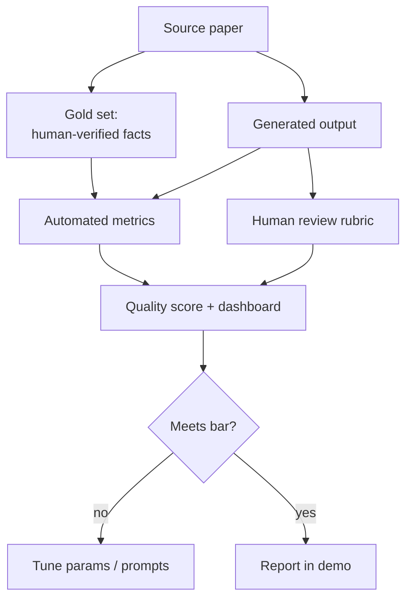
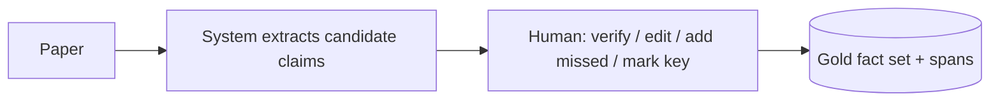

# UniPress DE — Evaluation Framework

> **DEIK.AI Challenge 2026 · Category 2.C** · Companion to [`04-content-outputs.md`](04-content-outputs.md)
> How we prove the system works with numbers — automated + human — realistically for a solo student project, without a research-scale dataset.

> **Design record.** Written before the build and kept as written, so the reasoning
> behind each decision stays legible. It is not a to-do list and not a description of
> the deployed system — for that see [`09-live-system.md`](09-live-system.md), which is
> authoritative wherever the two differ.

---

## 0. Philosophy

"The output looks good" is not evaluation. But neither is a 10,000-example benchmark realistic for a solo build. Our answer: **a small, high-quality, hand-curated gold set + cheap automated metrics that run on every generation + a lightweight structured human review.** The goal is *credible, reproducible evidence* the jury can trust — and a live dashboard that makes it visible in the demo.



---

## 1. What we measure (the 11 dimensions → concrete metrics)

Mapping your brief's list to metrics we can actually compute:

| # | Dimension | Metric | Method | Type |
|---|---|---|---|---|
| 1 | Factual accuracy | **Claim precision** = supported factual sentences / all factual sentences | TrustLayer verdicts vs. gold | Auto |
| 2 | Hallucination rate | **Unsupported+contradicted / all factual sentences** | TrustLayer + gold check | Auto |
| 3 | Source faithfulness | **Faithfulness score** (RAGAS-style: claims entailed by source) | NLI/LLM-judge against cited spans | Auto |
| 4 | Completeness | **Coverage** = key gold facts present / total key gold facts | claim matching to gold | Auto |
| 5 | Readability | **Flesch (EN) / syllable heuristic (HU)** + target-band hit rate | textstat | Auto |
| 6 | Audience appropriateness | **Rubric 1–5** per output type | human | Human |
| 7 | Communication quality | **Rubric 1–5** (clarity, flow, engagement) | human | Human |
| 8 | Citation/evidence correctness | **Evidence accuracy** = correct span links / all cited sentences | spot-check vs. gold | Auto+Human |
| 9 | Generation latency | seconds per output; p50/p95 | instrumentation | Auto |
| 10 | Cost | tokens × price; local vs. hosted | gateway accounting | Auto |
| 11 | Reviewer satisfaction | **Edit distance** (how much humans changed it) + 1–5 rating | review UI logs | Human |

**Headline metrics for the pitch:** *hallucination rate*, *faithfulness*, *coverage*, and *reviewer edit rate*. Four numbers that tell the whole story.

---

## 2. The gold set (ground truth) — small but rigorous

### 2.1 Size
- **10–15 papers** across 2–3 domains (e.g. CS/AI, health, environmental — the last ties to Debrecen's themes).
- Per paper: **15–30 gold facts** (atomic, human-verified, each with source location) + a flagged subset of **"key facts"** (the must-not-miss findings).
- Total ≈ **200–400 gold facts** — enough for stable percentages, small enough for one person to build in ~2–3 days.

### 2.2 How to build ground-truth facts (semi-automated, human-final)

The extractor does the heavy lifting; the human **verifies, corrects, and adds anything missed** — far faster than writing facts from scratch, and it doubles as a test of the extractor. Store gold as versioned JSON/YAML in the repo (`eval/gold/`).

### 2.3 Also build: an "adversarial" mini-set
- 3–5 hand-written **overclaim traps**: paraphrases that subtly change a number, drop a caveat, or overstate a finding. These prove TrustLayer *catches* problems, not just passes clean text. Great demo material.

---

## 3. Automated evaluation — how each metric is computed

### 3.1 Faithfulness & hallucination (the core)
- For each generated factual sentence: is it entailed by its cited span? (reuse TrustLayer's NLI + judge).
- **Hallucination rate** = (UNSUPPORTED + CONTRADICTED) / factual sentences.
- **Faithfulness** = mean supported_fraction across factual sentences.
- Cross-check against gold: a sentence marked SUPPORTED whose fact contradicts a gold fact = a **false-supported** (the most important error to catch — track it explicitly).

### 3.2 Coverage / completeness
- Match generated claims to gold facts by embedding similarity + entity overlap (threshold tuned).
- **Coverage** = matched key gold facts / all key gold facts.
- Report **omitted limitations** separately (dropping a caveat is a quality failure even if coverage is high).

### 3.3 Evidence correctness
- For a sample of cited sentences, check the cited span actually contains the supporting text (the quote-in-span check from `03`). Report % correct links.

### 3.4 Readability
- `textstat` Flesch reading ease / grade level (EN); syllable-per-word + sentence-length heuristic (HU). Report band-hit rate vs. each output's target.

### 3.5 Latency & cost
- Instrument every stage (from `02` observability). Report p50/p95 latency per output type and token cost per paper, split local vs. hosted — directly supports the hybrid-strategy argument.

### 3.6 Reference-based sanity (optional, secondary)
- ROUGE/BERTScore of the executive summary vs. the paper abstract as a *weak* sanity signal only — **not** a primary metric (abstracts aren't ground truth for a press release). Documented as such to avoid over-claiming our own evaluation.

**Tooling:** RAGAS (faithfulness/answer-relevance) where it fits, `textstat`, `sacrebleu`/`bert-score`, plus our own claim-matching. All wired into a single `eval/run_eval.py` producing a JSON report + Markdown table.

---

## 4. Human evaluation — lightweight but structured

### 4.1 Rubric (per output, 1–5)
| Criterion | 1 | 3 | 5 |
|---|---|---|---|
| Factual accuracy | multiple errors | minor slip | fully accurate |
| Audience fit | wrong register | mostly ok | perfectly pitched |
| Clarity/flow | confusing | readable | excellent |
| Completeness | key facts missing | most present | all key facts |
| Usability (would I publish after light edits?) | rewrite needed | some edits | ready |

### 4.2 Implicit signal — edit distance
The review UI already captures accept/edit/flag. **Normalized edit distance** between generated and human-finalized text = an objective proxy for quality that costs the reviewer nothing extra. Track it per output type over time — a falling edit rate is a compelling improvement story.

### 4.3 Who reviews
- You (dogfooding) for iteration.
- **1–2 external raters** (a peer, ideally someone comms-adjacent) on the final gold-set outputs for the report — small N, but real and honest about it.

---

## 5. The quality score (aggregate)

A single 0–100 per output for the dashboard, weighted toward trust:

```
quality = 100 * (
    0.35 * faithfulness
  + 0.25 * (1 - hallucination_rate)
  + 0.20 * coverage
  + 0.10 * evidence_correctness
  + 0.10 * readability_band_hit
)
```
- Human rubric shown alongside (not folded in — kept separate so it's not gamed).
- Weights configurable; the trust-heavy default is defensible to an academic jury.

---

## 6. Acceptance bars (targets to state in the demo)

Honest, achievable targets (not "99%"):

| Metric | MVP target | Stretch |
|---|---|---|
| Hallucination rate | < 5% of factual sentences | < 2% |
| Faithfulness | > 0.90 | > 0.95 |
| Key-fact coverage | > 0.85 | > 0.92 |
| Evidence correctness | > 0.95 | > 0.98 |
| Adversarial traps caught | 100% of the mini-set | — |
| Reviewer edit rate | < 20% of text changed | < 10% |

Stating targets **and** whether we hit them (including where we fell short) is more credible than claiming perfection.

---

## 7. Ablations (cheap experiments that make the project look serious)

Each is a toggle we already have; run on the gold set and put the table in the report/pitch:

1. **TrustLayer on vs. off** → shows hallucination rate drop (the headline chart).
2. **Claim-bound generation vs. free-form** → shows faithfulness gain.
3. **Hosted vs. local LLM** → quality/cost/latency trade-off (justifies hybrid).
4. **Numeric-always-escalate vs. gated** → shows numeric error reduction.
5. **Tier-1 gating aggressiveness** → cost vs. rigor curve.

> The "TrustLayer on/off" bar chart is likely the single most persuasive visual in the 3-minute video.

---

## 8. Experiment tracking & reproducibility

- **MVP:** `eval/run_eval.py` → timestamped JSON + Markdown report in `eval/reports/`; config (models, thresholds, weights) captured per run.
- **Competition+:** MLflow to log runs/params/metrics and compare experiments (matches your MLOps direction, low overhead).
- Gold set + configs versioned in git → every reported number is reproducible. This reproducibility is itself a selling point.

---

## 9. Deliberate limits (stated honestly)

- Small N (10–15 papers) → we report **descriptive** results, not statistical significance; we say so.
- Human ratings are few → treated as qualitative signal, not proof.
- No comparison to commercial tools by default (uneven, hard to be fair) — optional informal side-by-side if time allows.
- We do **not** claim domain-general performance; we claim strong, evidence-backed performance on the tested domains.

## Next phase

**Dataset & Testing Strategy** (`06-dataset-strategy.md`) — exactly which papers to use, licensing/copyright compliance, how to handle tables/PDFs/scanned docs, and the concrete steps to build the gold set defined here.
