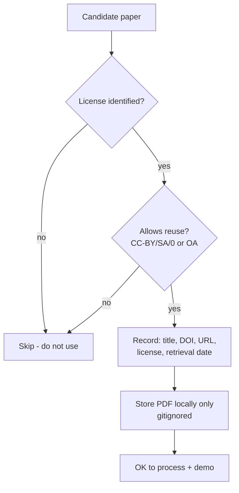

# UniPress DE — Dataset & Testing Strategy

> **DEIK.AI Challenge 2026 · Category 2.C** · Companion to [`05-evaluation.md`](05-evaluation.md)
> Which documents to use, how to stay legally clean, how to build the test set, and how to handle messy real-world PDFs.

---

## 0. Guiding rule

**Use only documents we can legally process and, where needed, redistribute the derived outputs in a demo.** The competition explicitly makes participants responsible for licensing/terms of use. So: prefer **open-access with explicit reuse licenses**, keep provenance for every document, and never commit copyrighted PDFs to the repo (already enforced in [`.gitignore`](../.gitignore)).

---

## 1. What documents to use

### 1.1 Primary source: open-access research papers
| Source | Why | Licensing reality |
|---|---|---|
| **arXiv** | Huge, born-digital PDFs, CS/AI/physics | Per-paper license varies — **check each**. Many are CC-BY / CC-BY-SA / CC0; some are arXiv's non-exclusive license (redistribution limited). Filter to CC-licensed papers. |
| **PubMed Central OA Subset** | Biomedical, clean structure | The **PMC Open Access Subset** is explicitly licensed for reuse (mostly CC-BY / CC-BY-NC). Ideal. |
| **DOAJ** | Directory of OA journals | Journal-level license info; pick CC-BY journals. |
| **PLOS / MDPI / Frontiers** | Fully OA publishers | Predominantly **CC-BY** — very safe. |
| **University of Debrecen repository / Hungarian OA** | Local relevance, possible HU-language papers | Check item-level license; great for the HU side + jury resonance. |

**Selection filter:** prefer **CC-BY / CC-BY-SA / CC0** → clearest reuse rights. Record the license per paper.

### 1.2 Domains (2–3, deliberate)
1. **CS / AI** — your comfort zone; abundant on arXiv; easy to sanity-check facts.
2. **Health / biomedical** — PMC OA; high public-communication value; showcases numeric scrutiny.
3. **Environmental / sustainability** — ties to Debrecen's Green Sentinel theme; strong jury resonance and a cross-category story.

### 1.3 Language mix
- Mostly English papers (for volume), **plus 2–3 Hungarian or HU-relevant papers** so the bilingual claim is demonstrated on native HU source too — not only EN→HU generation.

### 1.4 How many
- **Development set:** 5–7 papers (iterate fast).
- **Gold/eval set:** 10–15 papers (from `05`), non-overlapping with dev.
- **Demo picks:** 2–3 visually clean papers with a clear headline finding, at least one with a good table/figure to show numeric verification.

---

## 2. Licensing & compliance workflow (do this per document)



- Maintain `eval/sources.csv` (or `data/manifest.yaml`): `title, authors, DOI/arXiv id, url, license, language, domain, retrieved_on`.
- **Attribution:** CC-BY requires credit — display source title + authors + license in generated outputs and the UI (good practice *and* good demo hygiene).
- **Do not** commit source PDFs or full-text; commit only the manifest + gold facts (short quoted spans for verification fall under fair-dealing/quotation, but keep them minimal).
- If unsure about a license → **don't use it.** There's more than enough clearly-licensed material.

---

## 3. Test set construction

### 3.1 Splits
| Split | Papers | Purpose |
|---|---|---|
| Dev | 5–7 | prompt/threshold iteration; can overfit here |
| Gold (eval) | 10–15 | reported metrics; **frozen**, no tuning against it |
| Demo | 2–3 | live presentation; clean + compelling |

Freezing the gold set (and versioning it in git) is what makes reported numbers honest — state this in the report.

### 3.2 Building ground-truth facts (recap of `05`, concrete steps)
1. Run the extractor → candidate claims JSON.
2. Human pass: verify each quote is real, fix atomicity, **add missed facts**, mark `key` facts, tag limitations.
3. Save to `eval/gold/<paper_id>.yaml` with spans.
4. Version + never edit during a metrics run (change = new dataset version).

### 3.3 Adversarial set
Hand-author 5–10 perturbations of real sentences (wrong number, dropped caveat, overstated finding, swapped entity). Store in `eval/adversarial/`. Used to prove TrustLayer detection.

---

## 4. Handling messy real-world documents (your checklist)

| Challenge | Strategy | MVP? |
|---|---|---|
| **Multi-column PDFs** | Layout-aware parser (PyMuPDF/Docling) preserves reading order; validate on 3 test papers | ✅ |
| **Tables** | Extract cells + coordinates; store table claims with cell-level spans; numeric verification compares exact cell values | ✅ (core tables) |
| **Figures/charts** | Extract caption + reference the figure region as a span; **no chart-data OCR** in MVP (cite the caption/nearby text) | Partial |
| **Equations** | Keep as text/LaTeX where the parser gives it; not a claim source | ✅ (pass-through) |
| **Scanned/image PDFs** | Detect image-only pages; **warn + skip** rather than silent failure; OCR deferred | Deferred |
| **References/citations** | Parsed as `BACKGROUND`; not treated as the paper's own findings | ✅ |
| **Encoding/Unicode (HU accents)** | Normalize UTF-8; test on Hungarian text early (á/é/ő/ű) | ✅ |
| **Very long papers** | Section-aware chunking; extract per section; cap tokens per LLM call | ✅ |

### 4.1 Conflicting information within a paper
- Both claims stored with their spans. If a generated sentence uses one, the **consistency check** (pairwise NLI, `03` §5.5) flags tension; UI shows both sources. We **never silently pick one**.

### 4.2 Missing information
- The generator may only use provided claims. If a requested angle isn't supported → it must emit an explicit "not stated in the source" rather than invent (enforced by no-new-facts rule + coverage report). This is a feature to demo, not a bug to hide.

### 4.3 Unsupported claims
- Blocked from export by default; shown red with reason; human override is logged with a note (auditable).

---

## 5. Data handling & privacy

- Source PDFs stored **locally only** (`data/raw/`, gitignored); processed in place.
- Hybrid mode → sensitive/unpublished documents can be processed **fully locally** (no external API) — the concrete privacy story for the jury.
- Generated outputs (`outputs/`) gitignored; manifests + gold facts (with minimal quoted spans) are the only data committed.
- Retention: demo data only; no personal data involved (public research papers).

---

## 6. Directory layout (data & eval)

```
data/
  raw/            # source PDFs (gitignored)
  manifest.yaml   # provenance + license per doc (committed)
eval/
  gold/           # <paper_id>.yaml verified facts + spans (committed)
  adversarial/    # perturbation traps (committed)
  reports/        # timestamped metric reports (gitignored or committed selectively)
  run_eval.py     # the harness (committed)
sources.csv       # human-readable source/license index (committed)
```

---

## 7. Concrete first actions (when we start building)

1. Pick **3 arXiv (CC-BY) + 2 PMC OA + 2 HU/UD-repo** papers → fill `manifest.yaml` with licenses.
2. Verify each is born-digital and parses cleanly (reject scanned ones for now).
3. Choose the 2–3 demo papers (clear finding + a good table).
4. Build gold facts for the eval set (semi-automated).
5. Author the adversarial set.

> Effort: ~2–3 focused days once the extractor works — front-loaded so evaluation is ready the moment generation is.

---

## 8. Compliance summary (for the one-pager / jury)

- **All sources open-access with reuse licenses (CC-BY/SA/0 or OA subset); provenance + license recorded per document.**
- **No copyrighted full text committed or redistributed; attribution shown on outputs.**
- **DKV transport / Green Sentinel data are 2.B-restricted** — *not* used as 2.C source material here (avoids terms-of-use conflicts).
- **Processing can run fully locally for privacy-sensitive inputs.**

## Next phase

**Technology Stack** (`07-tech-stack.md`) — the concrete, justified tech choices resolving the open decisions from `02`, mapped to MVP / competition / production, with a dependency list.
