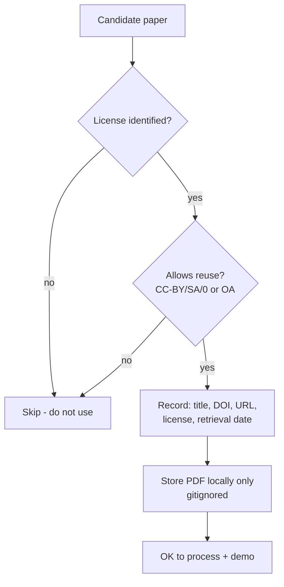

# UniPress DE — Dataset & Testing Strategy

> **DEIK.AI Challenge 2026 · Category 2.C** · Companion to [`05-evaluation.md`](05-evaluation.md)
> Which documents to use, how to stay legally clean, how to build the test set, and how to handle messy real-world PDFs.

> **Design record.** Written before the build and kept as written, so the reasoning
> behind each decision stays legible. It is not a to-do list and not a description of
> the deployed system — for that see [`09-live-system.md`](09-live-system.md), which is
> authoritative wherever the two differ.

---

## 0. Guiding rule

**Use only documents we can legally process and, where needed, redistribute the derived outputs in a demo.** The competition explicitly makes participants responsible for licensing/terms of use. So: prefer **open-access with explicit reuse licenses**, keep provenance for every document, and never commit copyrighted PDFs to the repo (already enforced in [`.gitignore`](../.gitignore)).

---

## 0.5 Official sample dataset (PROVIDED — this is our primary corpus)

The organizers provided sample materials for testing (`sample_files_for_PR/`, gitignored). See [`data/manifest.yaml`](../data/manifest.yaml) for full provenance. Summary:

| # | Document | Genre | Lang | License |
|---|---|---|---|---|
| 1 | PV power forecast post-processing (Solar Energy 2026) | Research paper | EN | **CC BY 4.0** |
| 2 | Pap smear automatic screening (Biomed. Signal Proc. 2026) | Research paper | EN | **CC BY 4.0** |
| 3 | UAV obstacle avoidance LT-DQN (Results in Eng. 2026) | Research paper | EN | **CC BY 4.0** |
| 4 | RL for observatory placement (PASP 2026) | Research paper | EN | **CC BY 4.0** |
| 5 | Data Science MSc curriculum (`AT MSc füzet`) | Educational doc | HU | UD institutional |
| 6 | IT/Maths/Physics teacher-training curriculum | Educational doc | HU | UD institutional |

**Three decisive facts:**
1. **All four research papers are authored by University of Debrecen, Faculty of Informatics researchers** (the judges' own faculty). Generating PR for these = maximum jury resonance. This *is* the flagship demo material.
2. **Two input genres, both represented, both bilingual-relevant:** scientific publications (EN) **and** educational/technical documentation (HU curricula). 2.C explicitly lists "educational documentation," and the organizers included it — so the system must handle **both** genres (see §1.5).
3. **Licensing is pristine:** all 4 papers are **CC BY 4.0** (reuse + redistribution permitted *with attribution*); the 2 curricula are UD's own institutional documents. We still keep the PDFs out of git (large, competition-provided) and display attribution on outputs.

**Implication:** the earlier "hunt for open-access papers" plan is now *secondary*. The provided set is the primary dev + demo corpus; externally-sourced CC-BY papers (§1.1) are only for **expanding the eval gold set** if we want more volume.

---

## 1. What documents to use (supplementary sources, if expanding beyond the sample set)

### 1.1 Primary source: open-access research papers
| Source | Why | Licensing reality |
|---|---|---|
| **arXiv** | Huge, born-digital PDFs, CS/AI/physics | Per-paper license varies — **check each**. Many are CC-BY / CC-BY-SA / CC0; some are arXiv's non-exclusive license (redistribution limited). Filter to CC-licensed papers. |
| **PubMed Central OA Subset** | Biomedical, clean structure | The **PMC Open Access Subset** is explicitly licensed for reuse (mostly CC-BY / CC-BY-NC). Ideal. |
| **DOAJ** | Directory of OA journals | Journal-level license info; pick CC-BY journals. |
| **PLOS / MDPI / Frontiers** | Fully OA publishers | Predominantly **CC-BY** — very safe. |
| **University of Debrecen repository / Hungarian OA** | Local relevance, possible HU-language papers | Check item-level license; great for the HU side + jury resonance. |

**Selection filter:** prefer **CC-BY / CC-BY-SA / CC0** → clearest reuse rights. Record the license per paper.

### 1.2 Domains (2–3, deliberate)
1. **CS / AI** — your comfort zone; abundant on arXiv; easy to sanity-check facts.
2. **Health / biomedical** — PMC OA; high public-communication value; showcases numeric scrutiny.
3. **Environmental / sustainability** — ties to Debrecen's Green Sentinel theme; strong jury resonance and a cross-category story.

### 1.3 Language mix
- Mostly English papers (for volume), **plus 2–3 Hungarian or HU-relevant papers** so the bilingual claim is demonstrated on native HU source too — not only EN→HU generation.

### 1.4 How many
- **Development + demo set:** the **6 provided sample documents** (primary).
- **Gold/eval set:** the 6 provided + optionally 5–9 externally-sourced CC-BY papers to reach ~10–15 for more stable percentages.
- **Demo picks:** 2–3 of the provided papers with a clear headline finding — recommend **Pap smear** (numbers), **UAV** (clean 100% result), **observatory placement** (visual appeal). Plus one **HU curriculum** to prove the second genre + native-HU processing.

### 1.5 Two input genres → two output modes (design update)

The sample set forces a broader-than-planned input surface. Both are in scope:

| Genre | Sample docs | PR/comms outputs | Notes |
|---|---|---|---|
| **Scientific publication** | 4 papers (EN) | Press release, public article, social, exec summary, video script | The flagship path; findings + numbers → research communication. |
| **Educational documentation** | 2 curricula (HU) | Programme highlight sheet, prospective-student post, "why study X at UD" brief, programme FAQ | Facts = programme structure, credits, specialisations, career outcomes — not "findings". |

**Solo-scope call:** lead the build and demo with the **research-paper path** (richer, stronger TrustLayer story). Support the **educational path** as a second `OutputSpec` family over the same pipeline — the claim model still applies (a "claim" from a curriculum = "The MSc requires 120 credits", cited to a page). This gives a genuine *breadth* moment in the demo without doubling the work, and directly answers the organizers' inclusion of educational docs.

---

## 2. Licensing & compliance workflow (do this per document)



- Maintain `eval/sources.csv` (or `data/manifest.yaml`): `title, authors, DOI/arXiv id, url, license, language, domain, retrieved_on`.
- **Attribution:** CC-BY requires credit — display source title + authors + license in generated outputs and the UI (good practice *and* good demo hygiene).
- **Do not** commit source PDFs or full-text; commit only the manifest + gold facts (short quoted spans for verification fall under fair-dealing/quotation, but keep them minimal).
- If unsure about a license → **don't use it.** There's more than enough clearly-licensed material.

---

## 3. Test set construction

### 3.1 Splits
| Split | Papers | Purpose |
|---|---|---|
| Dev | 5–7 | prompt/threshold iteration; can overfit here |
| Gold (eval) | 10–15 | reported metrics; **frozen**, no tuning against it |
| Demo | 2–3 | live presentation; clean + compelling |

Freezing the gold set (and versioning it in git) is what makes reported numbers honest — state this in the report.

### 3.2 Building ground-truth facts (recap of `05`, concrete steps)
1. Run the extractor → candidate claims JSON.
2. Human pass: verify each quote is real, fix atomicity, **add missed facts**, mark `key` facts, tag limitations.
3. Save to `eval/gold/<paper_id>.yaml` with spans.
4. Version + never edit during a metrics run (change = new dataset version).

### 3.3 Adversarial set
Hand-author 5–10 perturbations of real sentences (wrong number, dropped caveat, overstated finding, swapped entity). Store in `eval/adversarial/`. Used to prove TrustLayer detection.

---

## 4. Handling messy real-world documents (your checklist)

| Challenge | Strategy | MVP? |
|---|---|---|
| **Multi-column PDFs** | Layout-aware parser (PyMuPDF/Docling) preserves reading order; validate on 3 test papers | Handled |
| **Tables** | Extract cells + coordinates; store table claims with cell-level spans; numeric verification compares exact cell values | Handled (core tables) |
| **Figures/charts** | Extract caption + reference the figure region as a span; **no chart-data OCR** in MVP (cite the caption/nearby text) | Partial |
| **Equations** | Keep as text/LaTeX where the parser gives it; not a claim source | Pass-through |
| **Scanned/image PDFs** | Detect image-only pages; **warn + skip** rather than silent failure; OCR deferred | Deferred |
| **References/citations** | Parsed as `BACKGROUND`; not treated as the paper's own findings | Handled |
| **Encoding/Unicode (HU accents)** | Normalize UTF-8; test on Hungarian text early (á/é/ő/ű) | Handled |
| **Very long papers** | Section-aware chunking; extract per section; cap tokens per LLM call | Handled |

### 4.1 Conflicting information within a paper
- Both claims stored with their spans. If a generated sentence uses one, the **consistency check** (pairwise NLI, `03` §5.5) flags tension; UI shows both sources. We **never silently pick one**.

### 4.2 Missing information
- The generator may only use provided claims. If a requested angle isn't supported → it must emit an explicit "not stated in the source" rather than invent (enforced by no-new-facts rule + coverage report). This is a feature to demo, not a bug to hide.

### 4.3 Unsupported claims
- Blocked from export by default; shown red with reason; human override is logged with a note (auditable).

---

## 5. Data handling & privacy

- Source PDFs stored **locally only** (`data/raw/`, gitignored); processed in place.
- Hybrid mode → sensitive/unpublished documents can be processed **fully locally** (no external API) — the concrete privacy story for the jury.
- Generated outputs (`outputs/`) gitignored; manifests + gold facts (with minimal quoted spans) are the only data committed.
- Retention: demo data only; no personal data involved (public research papers).

---

## 6. Directory layout (data & eval)

```
data/
  raw/            # source PDFs (gitignored)
  manifest.yaml   # provenance + license per doc (committed)
eval/
  gold/           # <paper_id>.yaml verified facts + spans (committed)
  adversarial/    # perturbation traps (committed)
  reports/        # timestamped metric reports (gitignored or committed selectively)
  run_eval.py     # the harness (committed)
sources.csv       # human-readable source/license index (committed)
```

---

## 7. Concrete first actions (when we start building)

1. ~~Pick papers~~ → **Done: the 6 provided sample docs are the corpus** ([`data/manifest.yaml`](../data/manifest.yaml)).
2. Verify each parses cleanly (all born-digital; confirm HU accents + multi-column layout on the papers).
3. Confirm the 2–3 demo papers + 1 HU curriculum (see §1.4).
4. Build gold facts for the eval set (semi-automated) starting with the provided docs.
5. Author the adversarial set (perturb real sentences from these papers — e.g. change "88.8%" to "98.8%").
6. *(Optional)* add 5–9 external CC-BY papers if we want a larger gold set.

> Effort: ~2–3 focused days once the extractor works — front-loaded so evaluation is ready the moment generation is.

---

## 8. Compliance summary (for the one-pager / jury)

- **Primary corpus = the organizers' official sample materials, used for their intended testing purpose.**
- **All four research papers are CC BY 4.0** (reuse + redistribution permitted with attribution); the two curricula are the University of Debrecen's own institutional documents.
- **Attribution (title, authors, DOI, license) is shown on every generated output** and recorded in [`data/manifest.yaml`](../data/manifest.yaml).
- **PDFs are not committed to the repo** (large + competition-provided); only the manifest and gold facts (minimal quoted spans) are versioned.
- **DKV transport / Green Sentinel data are 2.B-restricted** — *not* used as 2.C source material here (avoids terms-of-use conflicts).
- **Processing can run fully locally for privacy-sensitive inputs.**

## Next phase

**Technology Stack** (`07-tech-stack.md`) — the concrete, justified tech choices resolving the open decisions from `02`, mapped to MVP / competition / production, with a dependency list.
