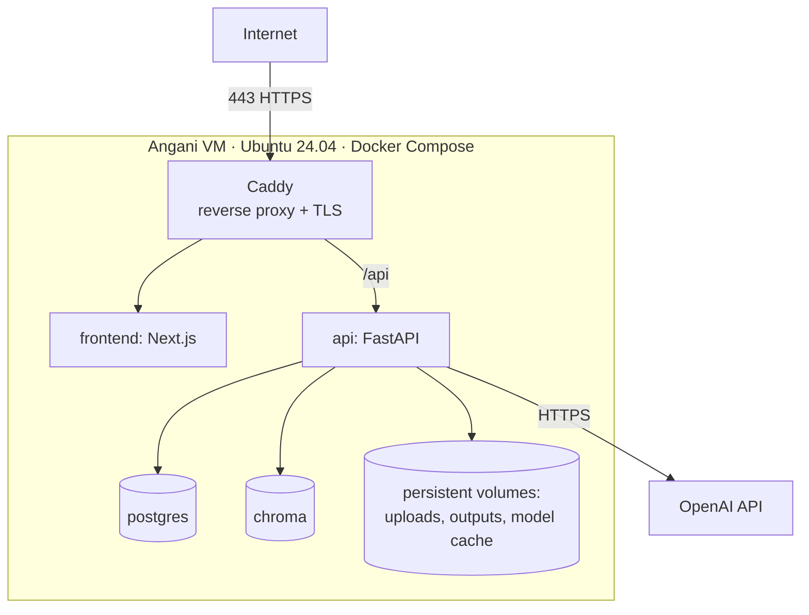

# UniPress DE — Technology Stack

> **DEIK.AI Challenge 2026 · Category 2.C** · Companion to [`06-dataset-strategy.md`](06-dataset-strategy.md)
> Concrete, justified technology choices. Resolves the open decisions from [`02-architecture.md`](02-architecture.md) §9 and [`03-ai-pipeline.md`](03-ai-pipeline.md) §9.

---

## 0. Selection criteria

Every choice is scored against: **(a)** does it serve the trust/traceability goal, **(b)** can a solo dev ship it by 25 Sept, **(c)** does it keep the "locally deployable / no lock-in" story, **(d)** is it open-source where practical, **(e)** does it match the builder's existing strengths (Python, Node/Next.js, Docker, cloud). Frontier LLM quality is the one place we accept a hosted dependency — behind a gateway so it's swappable.

---

## 1. The stack at a glance

| Layer | Choice | Why (one line) |
|---|---|---|
| Frontend | **Next.js 14 (App Router) + React + TypeScript + Tailwind** | Builder's strength; polished evidence-review UI = the demo |
| API | **FastAPI + Pydantic v2 + Uvicorn** | Typed structured outputs; async; Python-native AI |
| Orchestration | **Plain Python services** (no heavy agent framework) | Deterministic pipeline > opaque agent magic |
| PDF parsing | **PyMuPDF (fitz)** + **Docling** (fallback/structure) | Layout + coordinates for source spans |
| Sci-PDF structure | **GROBID** (optional service) | Best section/reference parsing for papers |
| Embeddings | **BGE-M3** (multilingual) via sentence-transformers | One model for HU + EN; strong retrieval |
| Reranker | **bge-reranker-v2-m3** (optional) | Precision boost when needed |
| NLI (TrustLayer T1) | **DeBERTa-v3 MNLI cross-encoder** | Fast local entailment; the cheap trust gate |
| LLM gateway | **LiteLLM** | One API over providers; swappable, no lock-in |
| LLM (generation) | **OpenAI (GPT-4o / GPT-4.1)** default; **local via Ollama** optional | Builder has OpenAI credits; quality by default; local fallback for privacy demo |
| Vector store | **Chroma** (dedicated) | Purpose-built vector DB; builder has prior experience → lower risk |
| Database | **PostgreSQL 16** | Claims, spans, metrics, provenance (relational) |
| Object/file store | **Local FS** (MVP) → S3-compatible (**MinIO**) later | Simple now, cloud-ready path |
| Templating/export | **Jinja2** + **WeasyPrint** (PDF), Markdown/HTML | Deterministic output rendering |
| Eval | **RAGAS**, **textstat**, **sacrebleu/bert-score**, custom | Faithfulness, readability, sanity |
| Experiment tracking | Files (MVP) → **MLflow** (competition+) | Reproducible metric runs |
| Observability | **structlog** + Postgres metrics (MVP) → **OpenTelemetry** | Latency/cost/eval visibility |
| Packaging | **uv** (Python), **pnpm** (JS) | Fast, reproducible installs |
| Deployment | **Docker + Docker Compose** | One-command local stack = "locally deployable" |
| CI | **GitHub Actions** (lint, test, build) | Cheap quality gate; MLOps-ready |

---

## 2. Resolved decisions (from architecture §9 / pipeline §9)

### 2.1 Parser — **PyMuPDF primary, GROBID optional**
- **Decision:** Start with **PyMuPDF** for text + coordinates (fast, pip-installable, gives bounding boxes for UI highlighting). Add **GROBID** only if section/reference detection on the sample papers is weak.
- **Why:** The sample papers are clean, born-digital, two-column Elsevier/IOP PDFs — PyMuPDF handles these well and avoids running a Java service on day one. Docling is the fallback for tricky layouts/tables.
- **Trade-off:** GROBID gives superior academic structure but adds ops weight; defer until a real gap shows.

### 2.2 Embedding model — **BGE-M3**
- **Decision:** **BGE-M3** (multilingual, 100+ languages incl. Hungarian; supports dense + sparse + multi-vector).
- **Why:** One model covers EN papers *and* HU curricula — critical for the bilingual requirement. Strong retrieval benchmarks, OSS, runs locally on CPU (keeps the privacy story + zero marginal cost).
- **Alternative:** multilingual-e5-large (also good); **OpenAI `text-embedding-3-large`** is a trivial swap given the OpenAI credits, but BGE-M3 stays the default for multilingual/HU quality, local execution, and no per-embedding cost. Decide by a quick retrieval test on 1 EN + 1 HU doc.

### 2.3 NLI model + threshold — **DeBERTa-v3 MNLI**, τ_high ≈ 0.85
- **Decision:** A DeBERTa-v3-large MNLI/FEVER cross-encoder for Tier-1 entailment; contradiction cutoff 0.5, entail cutoff τ_high = 0.85 (tuned on the gold set).
- **Why:** Small, fast, deterministic, runs local — the cheap gate that keeps most sentences off the LLM in verification. Multilingual NLI (e.g. mDeBERTa-XNLI) for HU output.
- **Trade-off:** English MNLI models are strongest; for HU verification use **mDeBERTa-v3-XNLI**; if quality lags, escalate HU sentences to the Tier-2 LLM judge more aggressively.

### 2.4 Hosted LLM (generation tier) — **OpenAI via LiteLLM**, swappable
- **Decision:** Default generation on **OpenAI GPT-4o / GPT-4.1**; **Tier-2 verification judge on a cheaper model (gpt-4o-mini)** to control cost. An **Ollama-served local model** (e.g. Llama/Qwen) is the optional drop-in for the offline/privacy demo. All calls route through **LiteLLM**, so switching provider/model is a config change.
- **Why:** The builder already has OpenAI credits, so it's the pragmatic default; generation quality and nuanced judging are what the jury sees. The LiteLLM gateway keeps the "no lock-in / locally deployable" narrative intact and enables the hosted-vs-local ablation in evaluation.
- **Model split:** big model for generation (quality shows), mini model for the verification judge (runs often → cost-sensitive). Both configurable per stage.
- **Cost control:** Tier-1 local NLI gating minimizes judge calls; extraction/generation cached per document; demo outputs pre-generated to avoid live rate limits.

### 2.5 Confidence-score formula — implemented as in `03` §5.4
- Weighted blend of NLI entailment + judge supported-fraction + numeric/entity overlap, with a hard numeric-mismatch penalty. Weights (`0.4/0.4/0.2`) and export threshold (`0.7`) are **config values**, tuned against the gold set.

### 2.6 Vector store — **Chroma** (chosen)
- **Decision:** Use **Chroma** as a dedicated vector store, run as its own service (or embedded/persistent mode) alongside Postgres.
- **Why:** The builder has prior hands-on experience with Chroma — for a solo build against a deadline, tool familiarity materially lowers delivery risk and speeds iteration. Chroma is open-source, runs locally (preserves the privacy/local-deploy story), and has a clean Python API and metadata filtering.
- **Consequence:** Two data services (Postgres for relational/provenance, Chroma for vectors) instead of one. Accepted trade-off — the confidence/speed gain outweighs the extra container for a solo timeline.
- **Alternatives considered:** pgvector (one fewer service, but a new tool for the builder); Qdrant (excellent, but no prior experience). Documented upgrade path to **Qdrant** if production scale/multi-tenancy demands it.
- **Note:** Retrieval accesses vectors only through a thin `VectorStore` interface, so swapping Chroma → Qdrant later is a config/adapter change, not a rewrite.

---

## 3. Why NOT (rejected options, briefly)

| Rejected | In favor of | Reason |
|---|---|---|
| LangChain / LlamaIndex as the backbone | Plain Python + thin helpers | Deterministic, debuggable pipeline; avoid framework churn/abstraction tax. May borrow small utilities only. |
| pgvector (vectors inside Postgres) | Chroma | Builder's prior Chroma experience → lower delivery risk for a solo deadline |
| Node/Nest backend | FastAPI | Keeps AI code in the Python ecosystem |
| Streamlit/Gradio UI | Next.js | The evidence-review UX is the product + the demo; needs real frontend |
| OpenAI/Cohere embeddings | BGE-M3 | Breaks the local/privacy story; multilingual OSS is strong enough |
| Fine-tuning for MVP | Prompt + RAG + verification | Training time/complexity not justified yet (revisit for Sprint) |
| Kubernetes for MVP | Docker Compose | Compose is enough to demo + claim local deployability |
| Agent framework (CrewAI/AutoGen) | Explicit pipeline | Trust requires determinism, not autonomous agents |

---

## 4. Component → stack mapping (MVP / Competition / Production)

| Capability | MVP | Competition | Production |
|---|---|---|---|
| PDF parse + spans | PyMuPDF | + Docling/GROBID | + OCR (Tesseract) |
| Embeddings | BGE-M3 (local) | same | GPU-served |
| Vector store | Chroma | Chroma | Qdrant (scale) |
| NLI verify | DeBERTa MNLI (local) | + mDeBERTa (HU) | fine-tuned |
| Generation/judge | OpenAI via LiteLLM | + local Ollama option | vLLM cluster |
| Frontend | Next.js | polished | same + auth |
| Storage | local FS | local FS | MinIO/S3 |
| Eval | files + RAGAS | + MLflow | CI-gated eval |
| Observability | structlog + PG | + OpenTelemetry | Prometheus/Grafana |
| Deploy | Docker Compose (local) | Compose on Angani VM + domain/TLS | K8s + Terraform |
| CI | GitHub Actions | same | + eval gates |

---

## 5. Repository & service layout (target)

```
unipress-de/
├── docker-compose.yml          # postgres, chroma, api, frontend, [ollama], [grobid]
├── .env.example
├── api/                        # FastAPI service
│   ├── pyproject.toml          # uv-managed
│   ├── app/
│   │   ├── ingestion/          # parse, chunk, spans
│   │   ├── claims/             # extraction + store
│   │   ├── retrieval/          # embeddings, chroma, rerank
│   │   ├── generation/         # per-output-type generators
│   │   ├── trustlayer/         # NLI + judge + scoring
│   │   ├── outputs/            # renderers (Jinja2/WeasyPrint), bilingual
│   │   ├── llm/                # LiteLLM gateway wrapper
│   │   ├── eval/               # run_eval.py, metrics
│   │   ├── models.py           # Pydantic contracts (from doc 03)
│   │   └── main.py
│   └── tests/
├── frontend/                   # Next.js app (upload, review, export)
├── data/                       # manifest.yaml (committed); raw/ gitignored
├── eval/                       # gold/, adversarial/, reports/
└── docs/                       # this documentation set
```

---

## 6. Core dependencies (indicative)

**Python (api):**
```
fastapi, uvicorn[standard], pydantic>=2, sqlalchemy, psycopg[binary], chromadb,
pymupdf, docling (optional), sentence-transformers, FlagEmbedding (BGE-M3),
transformers, torch, litellm, openai, ragas, textstat, sacrebleu, bert-score,
jinja2, weasyprint, structlog, python-multipart, tenacity, pytest
```
**JS (frontend):** `next, react, typescript, tailwindcss, @tanstack/react-query, zod`
**Infra:** `postgres:16`, `chromadb/chroma`, `ollama/ollama` (optional), `lfoppiano/grobid` (optional)
**Tooling:** `uv`, `ruff`, `mypy`, `pnpm`, GitHub Actions

---

## 7. Hardware & runtime notes (solo, realistic)

- **Target server:** Angani cloud VM — **8 vCPU / 16 GB RAM / 100 GB SSD, Ubuntu 24.04** (see §9). Generous for Profile A; embeddings + NLI have plenty of CPU headroom.
- **Embeddings + NLI** run on CPU comfortably for single-document workloads; BGE-M3 (~2–4 GB) and DeBERTa (~1.5–2 GB) load into RAM with room to spare on 16 GB.
- **Generation** is API-bound (OpenAI) → **no GPU needed** for the default path. The optional local Ollama path would want a GPU (not present on this VM), so it stays a documented option rather than a live demo feature here.
- **Everything comes up with `docker compose up`** — the single most important "it's real and deployable" signal for the jury.

---

## 8. Key risks in the stack (and mitigations)

| Risk | Mitigation |
|---|---|
| WeasyPrint system deps (cairo/pango) fussy in Docker | Pin a known-good base image; HTML/Markdown export as fallback |
| HU NLI quality weaker than EN | Escalate HU verification to Tier-2 LLM judge; report the gap honestly |
| Frontier LLM cost/rate limits during demo | Cache aggressively; pre-generate demo outputs; local Ollama fallback |
| Torch/CUDA image bloat | CPU-only torch wheel for MVP image; document GPU variant |
| GROBID/Ollama add ops weight | Both optional/profiled in compose; core stack runs without them |

## 9. Deployment & infrastructure (Angani cloud)

The system is **fully hosted** — nothing runs on the presenter's laptop during the demo. It is reached over the public internet at a `gilbertmutai.com` subdomain over HTTPS.

### 9.1 Server
- **Provider:** Angani cloud (builder's employer).
- **Spec:** 8 vCPU / 16 GB RAM / 100 GB SSD.
- **OS:** Ubuntu Server 24.04 LTS.
- **Runtime:** Docker Engine + Docker Compose (the same compose stack from local dev — dev/prod parity).

### 9.2 Public access + TLS + domain
- **Reverse proxy: Caddy** in front of the stack — **automatic HTTPS via Let's Encrypt** (auto-renewing certs), minimal config. It terminates TLS and routes to the frontend and API containers.
  - *Alternatives:* Traefik (label-driven, nice with Compose) or Nginx + Certbot (most manual). Caddy chosen for least-effort automatic TLS on a solo timeline.
- **DNS:** add an **A record** for the chosen subdomain → the VM's public IP, in the `gilbertmutai.com` zone.
- **Suggested subdomain:** `unipress.gilbertmutai.com` (frontend). API served under the same host at `/api` (single origin, no CORS hassle) — or `api.unipress.gilbertmutai.com` if we prefer split origins.

### 9.3 Compose topology (production)


### 9.4 Persistence & data
- **Named Docker volumes** for: Postgres data, Chroma data, uploaded PDFs, generated outputs, and the HF model cache (so BGE-M3/DeBERTa download once). These survive container restarts/redeploys.
- 100 GB SSD budget: OS + Docker images (~15 GB incl. CPU-only torch) + model cache (~8 GB) + Postgres/Chroma (small) + uploads/outputs — comfortable.

### 9.5 Security & ops
- **Firewall:** allow 80/443 (web) and 22 (SSH, ideally restricted to known IPs); everything else closed. Inter-container traffic stays on the Docker network — Postgres/Chroma are **not** published to the host/internet.
- **Secrets:** `.env` on the server (git-ignored) holds the **OpenAI API key**, DB credentials, etc. Never in the image or repo.
- **HTTPS everywhere:** Caddy handles cert issuance/renewal; app configured for the public origin.
- **Backups:** periodic dump of Postgres + Chroma volume (cheap `cron` + `pg_dump`), given the eval/gold data matters.
- **Updates/redeploy:** `git pull` + `docker compose up -d --build` on the VM; optional GitHub Actions → SSH deploy later (matches builder's CI/CD strength).

### 9.6 Cost & availability
- OpenAI usage billed to existing credits; Tier-1 NLI gating + caching + pre-generated demo outputs keep token spend low and remove live rate-limit risk during the presentation.
- VM runs continuously through the competition window; the public URL means judges can try it themselves (a strong credibility signal vs. a laptop-only demo).

---

## Next phase

**MVP Development Plan** (`08-dev-plan.md`) — the 12 phases as milestones with objectives, deliverables, tasks, definition-of-done, effort, dependencies, and risks — sequenced against the 25 Sept deadline.
