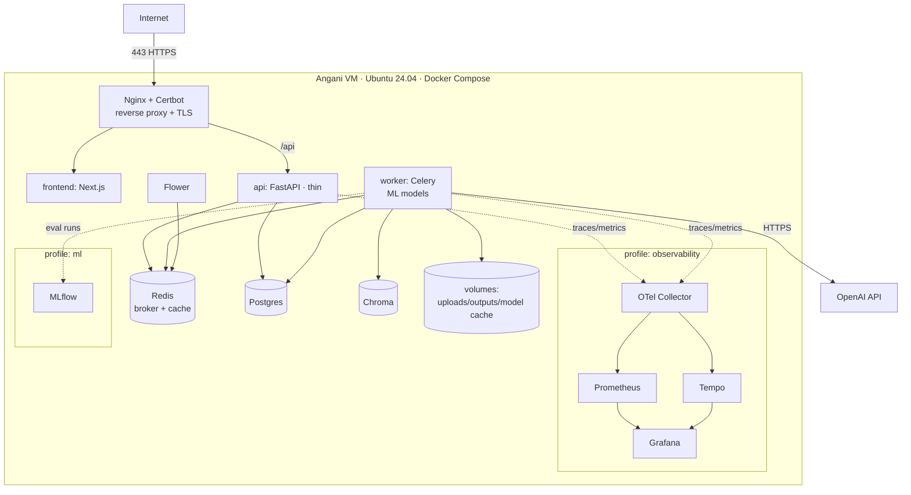

# UniPress DE — Technology Stack

> **DEIK.AI Challenge 2026 · Category 2.C** · Companion to [`06-dataset-strategy.md`](06-dataset-strategy.md)
> A production-oriented stack. Resolves the open decisions from [`02-architecture.md`](02-architecture.md) §9 and [`03-ai-pipeline.md`](03-ai-pipeline.md) §9.

> **Design record.** Written before the build and kept as written, so the reasoning
> behind each decision stays legible. It is not a to-do list and not a description of
> the deployed system — for that see [`09-live-system.md`](09-live-system.md), which is
> authoritative wherever the two differ.

---

## 0. Engineering stance & selection criteria

This system is built the way a working engineer builds production software, not as a throwaway prototype. Choices are justified by **engineering merit**, not by which is easiest to stand up:

- **Correctness & trust first** — the architecture exists to make output verifiable and auditable.
- **Dev/prod parity** — the same Docker Compose stack runs locally and on the server; no "works on my machine."
- **Async by design** — long-running ML/LLM work runs on a job queue, never blocking a request thread.
- **Observable by default** — metrics, traces, and structured logs from day one; you cannot operate what you cannot see.
- **Reproducible** — typed config, DB migrations, versioned eval runs; every result can be reproduced.
- **A real scaling path** — every component has a documented graduation route (Compose → K8s, Chroma → Qdrant, Ollama → vLLM) without a rewrite.
- **No gratuitous complexity** — components are included because they earn their place, and each is defended below. Familiar, proven tools are preferred over novel ones on a solo timeline.

Frontier-LLM quality is the one accepted hosted dependency — behind a gateway so it is swappable and never a lock-in.

---

## 1. The stack at a glance

| Layer | Choice | Engineering rationale |
|---|---|---|
| Frontend | **Next.js 14 (App Router) + TypeScript + Tailwind** | Type-safe UI; the evidence-review UX is the product |
| API | **FastAPI + Pydantic v2 + Uvicorn/Gunicorn** | Typed contracts, async I/O, OpenAPI out of the box |
| Config | **pydantic-settings** | 12-factor, typed, validated env config; no magic constants |
| Async processing | **Celery + Redis** (workers) | Decouples long ML/LLM jobs from HTTP; retries, concurrency, backpressure |
| Broker / cache | **Redis** | Task broker + result backend + memoization cache |
| Task monitoring | **Flower** | Live queue/worker visibility |
| Relational DB | **PostgreSQL 16** | Claims, spans, metrics, provenance — transactional, durable |
| Migrations | **Alembic** | Versioned, reviewable schema changes |
| Vector store | **Chroma** | Dedicated vector DB; builder-proven → lower delivery risk |
| PDF parsing | **PyMuPDF** + **Docling** (structure) | Layout + coordinates for source spans |
| Sci-PDF structure | **GROBID** (optional service) | Best-in-class section/reference parsing for papers |
| Embeddings | **BGE-M3** (multilingual, local) | One model for HU + EN; on-prem; zero per-call cost |
| Reranker | **bge-reranker-v2-m3** | Retrieval precision |
| NLI (TrustLayer T1) | **DeBERTa-v3 MNLI** (local) | Fast, deterministic entailment gate |
| LLM gateway | **LiteLLM** | Provider-agnostic; no lock-in; per-stage model routing |
| LLM (generation) | **OpenAI (GPT-4o / GPT-4.1)** default; **Ollama** optional | Existing credits; local path for privacy demo |
| Templating/export | **Jinja2** + **WeasyPrint** | Deterministic, testable output rendering |
| Eval framework | **RAGAS**, **textstat**, custom metrics | Faithfulness, hallucination, readability |
| Experiment tracking | **MLflow** | Versioned eval runs, params, metrics, artifacts |
| Metrics | **Prometheus** + prometheus-fastapi-instrumentator | Latency, cost, hallucination-rate as live series |
| Tracing | **OpenTelemetry** → **Tempo** | Distributed traces across API → worker → LLM |
| Logs | **structlog** (JSON) → **Loki** (optional) | Structured, correlated by trace ID |
| Dashboards | **Grafana** | Single pane: ops + eval metrics (a demo asset) |
| Packaging | **uv** (Python), **pnpm** (JS) | Fast, lockfile-reproducible installs |
| Reverse proxy / TLS | **Nginx + Certbot** | Builder's workflow; Let's Encrypt auto-renew |
| Deployment | **Docker + Docker Compose** (profiles) | Dev/prod parity; profiled service groups |
| CI/CD | **GitHub Actions** | Lint, type-check, test, **eval gate**, build/push, deploy |
| Quality gates | **ruff + mypy + pre-commit + pytest** | Enforced standards, not aspirational ones |

---

## 2. Resolved decisions (from architecture §9 / pipeline §9)

### 2.1 Parser — **PyMuPDF primary, Docling/GROBID for structure**
- **Decision:** PyMuPDF for text + coordinates (bounding boxes → UI highlight); Docling for complex layouts/tables; **GROBID** added if section/reference detection on the sample papers proves insufficient.
- **Rationale:** Source spans require positional metadata; PyMuPDF delivers it reliably on born-digital PDFs. GROBID is world-class for academic structure but adds a JVM service, so it is introduced against a measured need, not preemptively.

### 2.2 Embedding model — **BGE-M3**
- **Decision:** BGE-M3 (multilingual incl. Hungarian; dense + sparse + multi-vector), served locally in the worker.
- **Rationale:** One model satisfies the bilingual requirement, runs on-prem (privacy + zero marginal cost), and benchmarks strongly on multilingual retrieval. **OpenAI `text-embedding-3-large`** is a config-level swap given the credits, but local BGE-M3 is the stronger default for HU quality and data locality. Final pick confirmed by a retrieval A/B on 1 EN + 1 HU doc, tracked in MLflow.

### 2.3 NLI model + thresholds — **DeBERTa-v3 MNLI**
- **Decision:** DeBERTa-v3-large MNLI/FEVER cross-encoder for Tier-1 entailment; contradiction cutoff 0.5, entail cutoff τ_high = 0.85; **mDeBERTa-v3-XNLI** for Hungarian. Thresholds tuned on the gold set and versioned.
- **Rationale:** A small, deterministic, local model is the correct instrument for a high-frequency grounding check — cheap, reproducible, and it keeps most sentences off the paid LLM judge.

### 2.4 LLM (generation tier) — **OpenAI via LiteLLM**, per-stage routing
- **Decision:** Generation on **GPT-4o / GPT-4.1**; **Tier-2 judge on gpt-4o-mini**; optional local **Ollama** model for the privacy demo. All calls route through **LiteLLM** with **per-stage model routing** and centralized retry/timeout/cost accounting.
- **Rationale:** Existing OpenAI credits make it the pragmatic default; the gateway prevents lock-in, enables the hosted-vs-local ablation, and centralizes reliability concerns (timeouts, retries via `tenacity`, structured error handling). Big model where quality is visible, mini model where calls are frequent — a deliberate cost/quality allocation, not a shortcut.

### 2.5 Confidence-score formula — per `03` §5.4
- Weighted blend (NLI entailment + judge supported-fraction + numeric/entity overlap) with a hard numeric-mismatch penalty. Weights and export threshold are typed config, tuned against the frozen gold set, and the tuning run is logged to MLflow.

### 2.6 Vector store — **Chroma**
- **Decision:** Chroma as a dedicated vector service.
- **Rationale:** Builder has production experience with it → materially lower delivery risk on a solo timeline; open-source, on-prem, clean metadata filtering. Accessed only through a `VectorStore` port (hexagonal boundary), so graduating to **Qdrant** at production scale is an adapter swap, not a rewrite. Trade-off (a second data service alongside Postgres) is accepted as correct separation of concerns: relational data and vector indices have different scaling and backup profiles.

### 2.7 Async processing — **Celery + Redis** (new, deliberate)
- **Decision:** Ingestion → parsing → claim extraction → embedding → verification run as **Celery tasks** on dedicated worker containers, orchestrated as a chain with per-stage retries and idempotency keys. The API enqueues a job and returns immediately; the frontend tracks progress (poll/SSE). Redis is broker + result backend + memoization cache. **Flower** exposes queue/worker state.
- **Rationale:** These stages take seconds-to-minutes and call external models — running them inside a request thread is an anti-pattern that fails under any real load. A queue gives retries, concurrency control, backpressure, horizontal worker scaling, and crash recovery. This is the single clearest signal of production engineering in the system.
- **Alternative:** **Arq** (async-native, lighter) or **RQ**; Celery chosen for maturity, ecosystem, and recognizability. Documented as swappable behind a small task-dispatch interface.

### 2.8 Observability — **OpenTelemetry + Prometheus + Tempo + Grafana** (new, day one)
- **Decision:** Instrument API and workers with **OpenTelemetry** (traces + metrics); export via an **OTel Collector** to **Tempo** (traces) and **Prometheus** (metrics); visualize in **Grafana**. Structured JSON logs via **structlog**, correlated by trace ID (optionally shipped to **Loki**).
- **What we measure:** per-stage latency, LLM token usage + cost, cache hit rate, queue depth, and — crucially — **live eval signals** (hallucination rate, faithfulness, coverage) as first-class metrics.
- **Rationale:** Operability is a core engineering competency, and it is the builder's DevOps strength. Beyond good practice, the Grafana board turns the evaluation story into a **live dashboard** — one of the strongest possible demo visuals for a technical jury. Compose **profiles** keep the observability stack opt-in for lightweight local runs.

### 2.9 Data & reproducibility — **Alembic + MLflow + pydantic-settings**
- **Alembic:** every schema change is a reviewed, versioned migration — no ad-hoc `CREATE TABLE`.
- **MLflow:** eval runs (params, metrics, artifacts, model/threshold versions) are tracked and comparable, so every reported number is reproducible and improvement is provable.
- **pydantic-settings:** all config is typed and env-driven (12-factor); invalid config fails fast at boot.

---

## 3. Rejected options (with engineering reasoning)

| Rejected | In favor of | Reason |
|---|---|---|
| LangChain / LlamaIndex as backbone | Explicit Python + thin ports | Determinism, debuggability, and testability of a trust-critical pipeline outweigh framework convenience; abstraction tax and version churn are real costs |
| Synchronous request-time processing | Celery + Redis workers | Blocking a web thread on multi-second ML/LLM work does not survive load; queue gives retries/backpressure/scaling |
| Vectors inside Postgres (pgvector) | Chroma | Builder-proven tool lowers risk; relational vs. vector workloads have distinct scaling/backup needs (separation of concerns) |
| Print/log-only "monitoring" | OTel + Prometheus + Grafana | You cannot operate or demo what you cannot measure; observability is table stakes |
| Ad-hoc schema changes | Alembic migrations | Reproducibility and safe rollback |
| Streamlit/Gradio UI | Next.js | The evidence-review UX is the product and the demo; needs a real frontend |
| Agent framework (CrewAI/AutoGen) | Explicit orchestration | Trust requires deterministic, inspectable control flow, not autonomous agents |
| Kubernetes for the competition | Compose (profiles) on a VM | Compose is the right weight for one node; K8s is the documented production graduation, not premature ops burden |
| Fine-tuning for MVP | Prompt + RAG + verification | Not justified until eval shows a specific, repeatable gap (then revisit for the Sprint) |

---

## 4. Component → maturity mapping

| Capability | Competition (built) | Production (graduation path) |
|---|---|---|
| PDF parse + spans | PyMuPDF + Docling (+GROBID if needed) | + OCR (Tesseract/PaddleOCR) |
| Embeddings | BGE-M3 (CPU, local) | GPU-served / batched |
| Vector store | Chroma | Qdrant (multi-tenant, HA) |
| NLI verify | DeBERTa + mDeBERTa (local) | fine-tuned domain NLI |
| Generation/judge | OpenAI via LiteLLM | + self-hosted vLLM |
| Async jobs | Celery + Redis + Flower | Celery autoscaling / KEDA on K8s |
| Frontend | Next.js | + SSO/auth, multi-tenant |
| Storage | local FS via storage port | MinIO / S3 |
| Migrations | Alembic | same, CI-gated |
| Eval | RAGAS + custom + MLflow | eval as CD promotion gate |
| Observability | OTel + Prometheus + Tempo + Grafana | + Loki, alerting, SLOs |
| Deploy | Compose (profiles) on Angani VM + Nginx/Certbot | K8s + Terraform + Helm |
| CI/CD | GitHub Actions (lint/type/test/eval/build/deploy) | + canary, rollback |

Note: there is no "MVP-only throwaway" column — the MVP *is* the first slice of the production system, built on the production skeleton.

---

## 5. Repository & service layout (target)

```
unipress-de/
├── docker-compose.yml            # profiles: core | observability | ml | local-llm
├── docker-compose.override.yml   # local dev conveniences
├── .env.example
├── .github/workflows/ci.yml      # lint, type, test, eval-gate, build, deploy
├── .pre-commit-config.yaml
├── api/                          # FastAPI service (thin: enqueue + read)
│   ├── pyproject.toml            # uv-managed
│   ├── alembic/                  # migrations
│   ├── app/
│   │   ├── core/                 # settings (pydantic), logging, otel, deps
│   │   ├── ingestion/            # parse, chunk, spans
│   │   ├── claims/               # extraction + store
│   │   ├── retrieval/            # embeddings, chroma port, rerank
│   │   ├── generation/           # per-output-type generators
│   │   ├── trustlayer/           # NLI + judge + scoring
│   │   ├── outputs/              # renderers (Jinja2/WeasyPrint), bilingual
│   │   ├── llm/                  # LiteLLM gateway (routing, retry, cost)
│   │   ├── tasks/                # Celery app + task chains
│   │   ├── eval/                 # run_eval.py, metrics, MLflow logging
│   │   ├── telemetry/            # OTel + Prometheus wiring
│   │   ├── models.py             # Pydantic contracts (doc 03)
│   │   └── main.py
│   └── tests/                    # unit + integration
├── worker/                       # Celery worker image (loads ML models)
├── frontend/                     # Next.js app (upload, review, export)
├── ops/
│   ├── nginx/                    # server blocks
│   ├── prometheus/  grafana/  tempo/  otel-collector/
│   └── mlflow/
├── data/                         # manifest.yaml (committed); raw/ gitignored
├── eval/                         # gold/, adversarial/, reports/
└── docs/
```

**Architectural note:** the API is thin (validate → enqueue → read state); all heavy work lives in the worker. Ports/adapters (`VectorStore`, `LLMGateway`, `Storage`, `TaskDispatch`) keep infrastructure swappable and the domain testable.

---

## 6. Core dependencies (indicative)

**Python (api + worker):**
```
fastapi, uvicorn[standard], gunicorn, pydantic>=2, pydantic-settings,
sqlalchemy, alembic, psycopg[binary], chromadb,
celery, redis, flower,
pymupdf, docling (optional), sentence-transformers, FlagEmbedding (BGE-M3),
transformers, torch (CPU wheel), litellm, openai, tenacity,
ragas, textstat, mlflow,
jinja2, weasyprint,
opentelemetry-sdk, opentelemetry-instrumentation-fastapi,
opentelemetry-instrumentation-celery, opentelemetry-exporter-otlp,
prometheus-fastapi-instrumentator, structlog,
pytest, pytest-asyncio, ruff, mypy
```
**JS (frontend):** `next, react, typescript, tailwindcss, @tanstack/react-query, zod`
**Infra images:** `postgres:16`, `chromadb/chroma`, `redis:7`, `prom/prometheus`, `grafana/grafana`, `grafana/tempo`, `otel/opentelemetry-collector`, `ghcr.io/.../mlflow`, `mher/flower`, `ollama/ollama` (optional), `lfoppiano/grobid` (optional)
**Tooling:** `uv`, `pnpm`, `pre-commit`, GitHub Actions

---

## 7. Runtime & capacity plan (Angani VM: 8 vCPU / 16 GB / 100 GB)

- **Compute profile:** Profile A (no GPU). Generation is API-bound (OpenAI). Local ML is embeddings + NLI, loaded **once in the worker**, not the API.
- **Memory budget (approx):** worker ML models ~5–6 GB (BGE-M3 + DeBERTa + reranker) · Postgres/Redis/Chroma ~1.5 GB · observability stack (Prometheus/Grafana/Tempo/OTel) ~1.5–2 GB · MLflow/Flower/api/frontend ~1.5 GB · OS + headroom ~2 GB → fits 16 GB. Observability profile can be toggled off locally if needed.
- **CPU:** 8 vCPU comfortably covers concurrent embedding/NLI on the worker plus the light infra services; Celery concurrency tuned to core count.
- **Reliability:** health/readiness probes on api + worker; graceful shutdown drains in-flight tasks; Redis persistence for queue durability; nightly `pg_dump` + Chroma volume snapshot.
- **`docker compose up` brings the whole system online** — dev/prod parity, and the clearest "this is real and operable" signal for the jury.

---

## 8. Quality engineering (CI/CD + testing)

- **Pre-commit:** ruff (lint+format), mypy (types), basic hygiene — fail before commit.
- **CI (GitHub Actions):** lint → type-check → `pytest` (unit + integration against ephemeral Postgres/Redis/Chroma services) → **eval gate** (run the harness on a small fixed set; fail the build if hallucination rate regresses past threshold) → build & push images.
- **CD (optional):** on `main`, SSH deploy to the Angani VM (`git pull` + `docker compose up -d --build`, run Alembic migrations). Matches the builder's CI/CD strength.
- **Testing strategy:** unit tests for scoring/parsing/claim logic; integration tests for the task chain and API; golden-file tests for output rendering; the eval harness doubles as a regression guard.

---

## 9. Deployment & infrastructure (Angani cloud)

The system is **fully hosted** — nothing runs on the presenter's laptop during the demo. It is reached over the public internet at a `gilbertmutai.com` subdomain over HTTPS.

### 9.1 Server
- **Provider:** Angani cloud. **Spec:** 8 vCPU / 16 GB RAM / 100 GB SSD. **OS:** Ubuntu Server 24.04 LTS.
- **Runtime:** Docker Engine + Docker Compose — the same stack (with profiles) used in local dev.

### 9.2 Public access + TLS + domain
- **Reverse proxy: Nginx** (host-installed) terminates TLS and routes to the frontend and API containers.
- **TLS: Certbot (Let's Encrypt)** issues + auto-renews (`certbot --nginx` + systemd timer). Chosen to match the builder's existing workflow.
- **DNS:** A record for the subdomain → VM public IP in the `gilbertmutai.com` zone.
- **Suggested subdomain:** `unipress.gilbertmutai.com` (frontend); API under `/api` (single origin, no CORS). Grafana optionally at `/grafana` behind auth.
- Port 80 open for the ACME HTTP-01 challenge and redirects to 443.

### 9.3 Compose topology (production, profiled)


### 9.4 Persistence, security, ops
- **Named volumes:** Postgres, Chroma, Redis (AOF), uploads, outputs, HF model cache, Grafana, MLflow artifacts.
- **Firewall:** 80/443 + restricted SSH (22) only; all data services (Postgres/Redis/Chroma) stay on the internal Docker network, never published.
- **Secrets:** `.env` on the server (git-ignored) — OpenAI key, DB/Redis creds, Grafana admin. Never in images or repo.
- **Backups:** nightly `pg_dump` + Chroma/MLflow volume snapshots via cron.
- **Redeploy:** `git pull` + `docker compose up -d --build` + `alembic upgrade head` (scripted; optionally via GitHub Actions).

### 9.5 Cost & demo safety
- OpenAI billed to existing credits; Tier-1 NLI gating + Redis caching + pre-generated demo outputs keep spend low and remove live rate-limit risk.
- Public URL means judges can try it themselves; the Grafana dashboard makes the system's operability and eval metrics visible in real time.

## Next phase

**MVP Development Plan** (`08-dev-plan.md`) — the phases as milestones (objectives, deliverables, tasks, definition-of-done, effort, dependencies, risks), sequenced against 25 Sept, built on this production skeleton.
