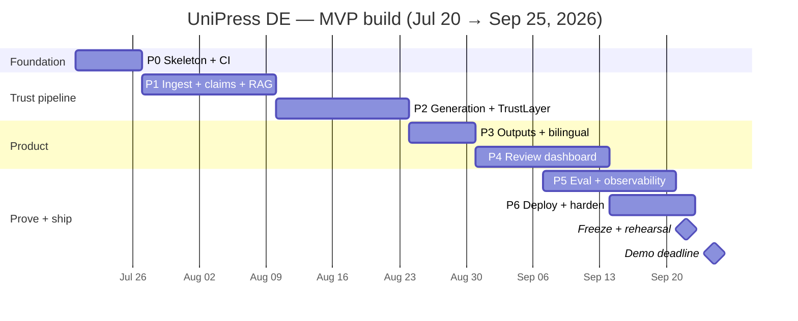
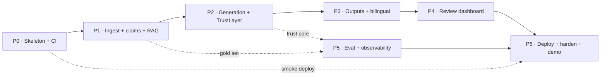

# UniPress DE — Build Record

_The phased development plan, kept with its per-phase outcome log._

> **DEIK.AI Challenge 2026 · Category 2.C** · Companion to [`07-tech-stack.md`](07-tech-stack.md)
> The build sequenced as milestones against the **25 September 2026** demo deadline, on the production skeleton from `07`.
> Anchor date: 19 July 2026 · ~10 working weeks · Solo build · Possible AI Sprint Final: 9–10 October 2026.

> **Build record — history, not a plan.** The phase sequence with an outcome log per
> phase: what was built, what was verified, and what was deviated from or deferred.
> Development is complete; nothing here is outstanding work. For the system as it runs
> today see [`09-live-system.md`](09-live-system.md).

---

## 0. How this plan is built

This is not a wishlist of features — it is a **critical path** to a demoable, trustworthy system, sequenced so that risk is retired early and the trust core is proven before polish begins.

Three engineering principles shape the sequence:

- **Walking skeleton first.** Week 1 delivers `docker compose up` bringing the *whole* system online with one hard-coded claim flowing API → worker → DB → UI. Every service, the CI pipeline, and one trace exist before any feature does. Integration risk is paid down on day one, not discovered in September.
- **Thin vertical slice, then deepen.** One real sample paper is pushed end-to-end (parse → claim → generate → verify → render) as early as possible; each stage is then deepened in place. We are never in a state where "nothing works yet" — the demo exists from Phase 2 and improves weekly.
- **Eval front-loaded.** The gold + adversarial sets (per [`06`](06-dataset-strategy.md)) are authored *alongside* the extractor, so the moment generation works there is already a scoreboard. Evaluation is a build-time instrument, not an afterthought.

Effort is stated in **focused engineering-days** (a solo builder's realistic ~5-day week with buffer). The plan reserves the final week for freeze, rehearsal, and contingency.

---

## 1. Timeline at a glance

| # | Phase | Weeks | Dates (2026) | Focus | Cumulative days | Status |
|---|---|---|---|---|---|---|
| **P0** | Foundation & walking skeleton | W1 | Jul 20 – Jul 26 | Compose up, CI, ports, one round-trip | 5 | Complete |
| **P1** | Ingestion, claim store & retrieval | W2–W3 | Jul 27 – Aug 9 | PDF → verified claims → RAG | 15 | Complete |
| **P2** | Generation + TrustLayer (**trust core**) | W4–W5 | Aug 10 – Aug 23 | Claim-bound gen, NLI + judge + scoring | 25 | Complete |
| **P3** | Outputs & bilingual rendering | W6 | Aug 24 – Aug 30 | 5 output types × HU/EN, evidence trail | 30 | Complete |
| **P4** | Review dashboard (**the product**) | W7–W8 | Aug 31 – Sep 13 | Upload → review-with-highlights → export | 40 | Complete |
| **P5** | Evaluation, MLflow & observability | W8–W9 | Sep 7 – Sep 20 | Harness, eval-gate, Grafana board, gold set | 47 | Complete |
| **P6** | Deploy, harden & demo | W9–W10 | Sep 14 – Sep 25 | Angani VM, TLS, rehearse, **freeze** | 52 | Partial |

> P5 overlaps P4 by design — the gold set and metrics accrue while the frontend is built. **Feature freeze: Mon 22 Sep**; Tue 23 – Fri 25 is rehearsal + contingency buffer.

---

## 2. Phase 0 — Foundation & walking skeleton

**Weeks:** W1 (Jul 20–26) · **Effort:** ~5 days · **Depends on:** nothing (start immediately)

**Objective.** Stand up the entire production skeleton from [`07` §5](07-tech-stack.md) so that `docker compose up` brings every core service healthy and a single hard-coded claim round-trips API → Celery worker → Postgres → Next.js — with CI green and one distributed trace visible. This retires integration risk before any feature is written.

**Deliverables**
- Repo layout per `07` §5 (`api/`, `worker/`, `frontend/`, `ops/`, `data/`, `eval/`).
- `docker-compose.yml` with **profiles** (`core | observability | ml | local-llm`) + `override` for dev; `.env.example`.
- `pydantic-settings` config; Postgres 16 + **Alembic** initial migration; Redis; **Celery** app + **Flower**.
- Empty **ports** (`VectorStore`, `LLMGateway`, `Storage`, `TaskDispatch`) with in-memory/stub adapters.
- FastAPI `/health` + `/ready`; a demo Celery task chain; Next.js shell that reads task state.
- **CI** (GitHub Actions): ruff → mypy → pytest against ephemeral services; **pre-commit** installed.
- OTel + Prometheus instrumentation wired on api + worker (observability profile).

**Definition of Done**
- `docker compose --profile core up` → all services healthy; `--profile observability` adds OTel/Prom/Tempo/Grafana.
- A submitted job flows through Celery and its result is readable via the API and shown in the UI shell.
- CI is green on `main`; one end-to-end trace (api → worker) is visible in Tempo.

**Risks:** dependency/version friction (torch CPU wheel, WeasyPrint system libs) → pin versions, bake into images early. Docker resource pressure on the dev machine → use profiles to run lean locally.

**Status: delivered (19 Jul 2026).** Repo scaffolded (`api/`, `worker/`, `frontend/`, `ops/`); Compose profiles (`core | observability | ml | local-llm`) validate; api+worker share one image (ML split deferred, see `worker/README.md`); Alembic `0001_initial` creates the `jobs` table; the four ports ship with stub adapters; `/health` + `/ready` live; the demo Celery chain (`ingest → parse → embed → verify → finalize`) runs. **Verified live:** `docker compose --profile core up` healthy, a job round-trips API → Celery → Postgres to `done`, worker logs each stage as structured JSON. Backend CI-clean (ruff, mypy, 6 pytest); frontend type-checks + builds. **Deferred to a follow-up within P1:** confirming the api→worker trace lands in Tempo (instrumentation is wired), and the dev-convenience code bind-mount/hot-reload.

---

## 3. Phase 1 — Ingestion, claim store & retrieval

**Weeks:** W2–W3 (Jul 27 – Aug 9) · **Effort:** ~10 days · **Depends on:** P0

**Objective.** Turn a real sample PDF into a **queryable, span-linked claim store** with working retrieval — the factual substrate everything downstream is constrained to. Per [`03` §2–4](03-ai-pipeline.md).

**Deliverables**
- **Parsing** (PyMuPDF): text + page/section/**bounding-box** spans; Docling for complex tables/layouts; image-only-page detection → warn (no OCR, per `03`).
- **Chunking** with structure + positional metadata preserved for UI highlight.
- **Claim extraction** → `Claim` records (doc `03` contract) each with `source_span` (page/section/verbatim quote) and a **quote-verification** step that rejects any claim whose quote is not found in the source text.
- **Embeddings** (BGE-M3, local in worker) → **Chroma** via the `VectorStore` port; **bge-reranker-v2-m3** rerank.
- Celery **chain**: `ingest → parse → chunk → extract → embed`, with per-stage retries + idempotency keys.
- **Eval (front-loaded):** author gold facts + adversarial perturbations for **2 papers (1 EN + 1 HU)** alongside the extractor ([`06` §7](06-dataset-strategy.md)).

**Definition of Done**
- The 4 sample research papers + 1 HU curriculum parse cleanly (HU accents + multi-column confirmed).
- A chosen sample paper yields a claim store where **every claim's quote is verifiably present** in the source.
- Retrieval returns relevant chunks for probe queries in **both HU and EN**; retrieval A/B (BGE-M3 vs `text-embedding-3-large`) logged to MLflow to confirm the default.

**Risks:** multi-column / table extraction quality on the papers → GROBID is the pre-scoped fallback (`07` §2.1), introduced only against a measured need. HU tokenization/accents → verified explicitly on the curriculum in DoD.

**Status: delivered.** 1a (ingestion) and 1b (claim extraction) landed 19 Jul 2026; 1c (retrieval) below. The P1 tail — gold set and retrieval A/B — closed under P5 workstreams B and C.
- **1a — Built:** PyMuPDF parser (text + bbox blocks, image-only detection → warning); structure-aware chunker (page-bounded chunks, best-effort section detection, exact `SourceSpan` provenance); `Document`/`Chunk` tables + Alembic `0002`; `Storage` port wired for uploads (shared api/worker volume); `POST /documents` + `GET /documents/{id}` + `/chunks`; Celery chain `parse → chunk → finalize`. **Verified:** all 6 sample PDFs parse cleanly (page counts match manifest; HU accents preserved; **0 chunk-provenance failures**); end-to-end EN 10p/94 chunks, HU 9p/19 chunks.
- **1b — Built:** the **quote-verification guardrail** (docs/03 §2.3 — exact + whitespace-flexible span location; rejects any quote not literally in source); deterministic **heuristic extractor** (sentence split, cue-based typing into QUANTITATIVE/FINDING/METHOD/LIMITATION, numeric flag, importance ranking, dedup) as the no-key default; **LiteLLM `LLMGateway`** adapter + schema-constrained **LLM extractor** behind the same guardrail, **opt-in** via `llm_extraction` flag + key (default off, so zero spend by default); `Claim` table + Alembic `0003`; `extract` Celery stage (`parse → chunk → extract → finalize`); `GET /documents/{id}/claims`. **Verified:** 0 claim-provenance failures on all 4 papers; end-to-end pap-smear paper → **76 claims** with correct types + spans (e.g. QUANTITATIVE "over 12 million individual cell predictions", p1). 20 pytest, ruff + mypy clean.
- **Known gap:** heuristic extractor yields 0 claims on the HU curricula (English cues, low claim density) — the LLM path or HU cues address this later; curricula drive programme-promotion outputs, not claim-dense press releases.
- **1c — Built:** the retrieval layer (RAG "R"). `Embedder` port with a **SentenceTransformer** backend (**default `multilingual-e5-small`**, HU+EN; **BGE-M3 swappable via `EMBED_MODEL`** on the VM) + a deterministic **hashing** stub for tests; **`VectorStore` port redesigned** (`add`/`query`/`delete` with embeddings + metadata) with **`ChromaVectorStore`** (HTTP/persistent) and `InMemoryVectorStore`; `embed` Celery stage (`parse → chunk → extract → embed → finalize`); **`POST /documents/{id}/search`** (embed query → Chroma similarity → span-linked hits); Chroma service + HF-cache volume in compose. **Verified:** hashing+in-memory tests green; real semantic retrieval with e5-small on sample papers (HU + EN queries return relevant chunks — see below).
  - **Deviation (recorded):** runtime embed default is `multilingual-e5-small`, not doc `07`'s BGE-M3 — chosen for a fast, light dev/demo loop; BGE-M3 remains the documented VM default and is a one-line `EMBED_MODEL` swap. The **worker-image split** (`worker/`) is likewise **deferred** — with a light model the shared api/worker image is fine; the split lands when BGE-M3/GPU move onto the VM.
- **Remaining in P1:** `bge-reranker-v2-m3` rerank (optional, deferred — flag-gated), and the front-loaded **gold + adversarial eval set** (1 EN + 1 HU) + retrieval **A/B → MLflow** (moves toward Phase 5's harness). After that, Phase 1 is complete → Phase 2 (Generation + TrustLayer).

---

## 4. Phase 2 — Generation + TrustLayer (the trust core)

**Weeks:** W4–W5 (Aug 10–23) · **Effort:** ~10 days · **Depends on:** P1

**Objective.** Prove the differentiator: **claim-bound generation** whose every sentence is classified, grounded, and confidence-scored — with unsupported and numerically-wrong claims blocked. This is the single most important phase; it is scheduled at the midpoint so it has slack on both sides.

**Deliverables**
- **Claim-bound generator** via **LiteLLM** gateway (OpenAI GPT-4o/4.1 default), citation-aware, structured output, per-stage routing + centralized retry/timeout/cost (`tenacity`).
- **TrustLayer T1** — DeBERTa-v3 MNLI (EN) / mDeBERTa-v3-XNLI (HU) entailment gate; contradiction/entail cutoffs per [`07` §2.3](07-tech-stack.md).
- **TrustLayer T2** — LLM judge on `gpt-4o-mini` for sentences that pass T1 but need support-fraction adjudication.
- **Confidence score** per [`03` §5.4](03-ai-pipeline.md): weighted blend (NLI entailment + judge supported-fraction + numeric/entity overlap) with a **hard numeric-mismatch penalty**; sentence typing (fact / interpretation / framing / unsupported); export threshold as typed config.

**Definition of Done**
- A sample paper produces a **press release** where each sentence carries a type, a grounding link, and a score.
- An **unsupported claim is blocked or flagged**; a numeric perturbation from the adversarial set (e.g. `88.8% → 98.8%`) triggers the numeric penalty and is caught.
- Thresholds/weights tuned against the frozen gold set; the tuning run is versioned in MLflow.

**Risks:** local ML memory footprint (BGE-M3 + DeBERTa + reranker ≈ 5–6 GB) → models loaded **once in the worker** per `07` §7; validate the memory budget on the target VM spec early. Judge cost/latency → T1 gates most sentences off the paid judge; Redis memoization on repeated claims.

**Status: delivered.** 2a (claim-bound generation and the deterministic TrustLayer core) landed 20 Jul 2026; 2b (real NLI, LLM judge, coverage) below completes the trust core.
- **Built:** generation contracts (`OutputType`, `SentenceRole`, `Verdict`, `GeneratedSentence`/`Output`, `OutputSpec`); per-type specs (press release + exec summary, docs/04); **claim-bound generator** — deterministic fallback (renders verified claims, every factual sentence cites its claim key; no key needed) **+ opt-in LiteLLM path** (`llm_generation` flag + key, schema-constrained, one self-repair pass); **TrustLayer deterministic core** — numeric-mismatch check (2% rounding tolerance), quote-overlap, lexical-entailment proxy, confidence blend + hard numeric penalty (docs/03 §5.4), per-sentence verdict (SUPPORTED/INTERPRETATION/RHETORICAL/UNSUPPORTED/CONTRADICTED) with export threshold — all behind `Entailment` port; `outputs`/`output_sentences` tables + Alembic `0004`; generation Celery task; `POST /documents/{id}/outputs`, `GET /documents/{id}/outputs`, `GET /documents/outputs/{id}`.
- **Verified:** 25 pytest (ruff+mypy clean). TrustLayer unit tests prove the headline DoD deterministically — **`88.8% → 98.8%` numeric perturbation → CONTRADICTED**; a claim-less factual sentence → UNSUPPORTED; framing → RHETORICAL. End-to-end via TestClient (real DB): upload → extract → generate press release → every factual sentence carries a claim citation + verdict + confidence.
- **2b — Built (20 Jul 2026):** real **NLI** behind the `Entailment` port — `classify()` now returns 3-way scores (entail/neutral/contradict); `DebertaNLI` (mDeBERTa-XNLI, multilingual HU+EN, ~560MB) selected via `nli_backend="nli"`, lexical proxy still the default. **Tier-2 LLM judge** (`gpt-4o-mini`, opt-in via `llm_judge`) with supported-fraction + rationale; `verify.py` rewritten with proper gating (numeric mismatch → CONTRADICTED; NLI contradiction > cutoff → CONTRADICTED; judge only for numeric or not-clearly-entailed sentences) and the judge term wired into the confidence blend. **Document-level coverage** (`coverage.py`) — omitted high-importance claims + dropped-limitation warnings, stored on `outputs.coverage` (Alembic `0005`), surfaced in `OutputDetail`.
- **Verified:** 29 pytest (ruff+mypy clean), incl. NLI 3-way classify, judge gating (stubbed), coverage. **Live NLI re-scoring** of the 2a sentences: true paraphrase "…accuracy of 88.8%" → SUPPORTED 0.842 (was 0.65 lexical); numeric "98.8%" → CONTRADICTED; overclaim "significantly enhance" (source: "potential to assist") correctly UNSUPPORTED. mDeBERTa downloaded + ran locally (confirms VM path).
- **Deferred (Phase 5 harness):** pairwise-NLI consistency check (docs/03 §5.5); thresholds/weights tuning → MLflow. **Phase 2 complete → Phase 3 (bilingual outputs + rendering).**

---

## 5. Phase 3 — Outputs & bilingual rendering

**Weeks:** W6 (Aug 24–30) · **Effort:** ~5 days · **Depends on:** P2

**Objective.** Fan out the one verified claim store into all five audience-adapted artifacts, in **Hungarian and English**, each carrying its evidence trail and source attribution. Per [`04`](04-content-outputs.md).

**Deliverables**
- Five `OutputSpec`s: **press release · lay article · social posts · executive summary · 60-second video script** (script = structured JSON scenes → readable table; TTS/assembly stays a stretch module).
- **Bilingual** HU/EN generation — audience-adapted rewriting, not literal translation — with per-language TrustLayer verification.
- **Rendering:** Jinja2 templates → WeasyPrint PDF/HTML; golden-file tests on output structure.
- **Attribution footer** (title, authors, DOI, license) on every output, sourced from [`data/manifest.yaml`](../data/manifest.yaml).

**Definition of Done**
- All five outputs render in both languages for a sample paper, each with an inline evidence trail and correct attribution.
- Rendering is deterministic and covered by golden-file tests; HU output verified end-to-end on a HU-native source.

**Risks:** HU generation quality vs. EN → per-language verification catches drift; the HU curriculum is the native test bed. Output sprawl → all five are the *same* `OutputSpec` abstraction over one claim store; deferred formats (newsletter/FAQ/slides) stay out (`04` §deferred).

**Status: delivered (20 Jul 2026).**
- **Built:** all **five `OutputSpec`s** (press release, article, social, exec summary, video script) over the one claim store; **Jinja2 HTML rendering** (`app/outputs/`) with the inline **evidence trail** (per-sentence verdict badge + confidence + claim citations), **coverage warnings**, and an **attribution footer** (title/authors/venue/DOI/license) sourced from [`data/manifest.yaml`](../data/manifest.yaml); **WeasyPrint PDF** export (lazy import; Dockerfile ships pango/cairo libs; 501 if unavailable); `GET /documents/outputs/{id}/render?format=html|pdf`. **Bilingual:** `language` (en|hu) flows through generation → the LLM path regenerates per language (not translation); TrustLayer uses multilingual mDeBERTa so HU verification works.
- **Verified:** 33 pytest (ruff+mypy clean); HTML render carries evidence trail + verdict badges; attribution footer pulls real provenance from the manifest (e.g. Pap-smear paper → authors + DOI + CC BY 4.0).
- **Honest gaps:** the **deterministic fallback generator renders in the source language** (real HU output needs the LLM path — mechanism wired, not run to save credits); PDF export verified by code path but needs the container's system libs (works in the image, not bare local); per-type structure (esp. video-script scenes) is best-shaped by the LLM path.

---

## 6. Phase 4 — Review dashboard (the product)

**Weeks:** W7–W8 (Aug 31 – Sep 13) · **Effort:** ~10 days · **Depends on:** P3

**Objective.** Build the evidence-review UX — *the product and the demo*. A comms officer uploads a paper, watches it process, and reviews output with each claim highlighted against its source quote side-by-side, then accepts/edits/flags and exports.

**Deliverables**
- **Upload** flow → enqueue → **progress tracking** (poll/SSE) against Celery state.
- **Evidence-review view:** generated sentence ↔ source-span highlight (using P1 bounding boxes), sentence-type badges + confidence, blocked/flagged claims surfaced.
- **Accept / edit / flag** per element; **export** to bilingual PDF.
- Single-origin routing (frontend + `/api`), React Query data layer, Zod-validated contracts.

**Definition of Done**
- Full browser journey works end-to-end: **upload → progress → review-with-highlights → accept/edit → export bilingual PDF** — the exact 90-second live-demo path from [`01` §pitch](01-project-definition.md).
- Flagged/blocked claims and confidence scores are legible to a non-technical reviewer.

**Risks:** frontend is the largest single chunk of UI work for a backend-leaning solo builder → keep it purposeful (review UX only, no auth/settings sprawl — auth is a production graduation, `02` §8); reuse the highlight primitive across all output types.

**Status: delivered (20 Jul 2026).**
- **Built:** the Next.js review dashboard (`frontend/`). Typed API client (`app/lib/api.ts`) over the real endpoints. Three-step flow in `app/page.tsx`: **1) upload** a PDF → **poll ingestion** status (parsing→chunking→claims→embeddings) with page/chunk/claim counts; **2) generate** — pick output type (all 5) + language (EN/HU); poll the generation job → load the output; **3) review** — `EvidenceReview` component: left = generated sentences with **verdict badges + confidence + claim citations** (blocked UNSUPPORTED/CONTRADICTED ring-flagged), right = **source evidence** side-by-side (click a sentence → its cited claims' quotes with page/section), plus **accept/flag** per sentence, a **coverage-warning banner**, and **export** links (HTML / PDF via the render endpoint).
- **Verified live (browser + full stack):** the entire journey — upload → progress → generate → review → export — confirmed on the running `docker compose` stack after fixing the blockers found there (Docker credential helper; Chroma client/server version match; frontend `node:22` + pinned pnpm).
- **Product-polish pass (delivered same day):** editorial design system (Fraunces + Inter, warm palette, light/dark, CVA primitives); **University of Debrecen logo** in the header; **real ingestion progress** — the api reports `stage`+`progress` (0–100) on the document and the UI shows a determinate bar + stage label + %; **indeterminate "Generating…" bar**; state-aware step headings; plain-language copy; and the **killer feature** — a new `GET /documents/{id}/pages/{n}.png` endpoint (PyMuPDF) that renders the real source page with the cited span highlighted, shown side-by-side in the review panel.
- **Deviations/gaps (recorded):** vanilla `fetch` + polling instead of React Query/Zod; **accept/flag is client-side only** (no persistence endpoint yet); direct api origin in dev (single-origin via nginx is Phase 6).

---

## 7. Phase 5 — Evaluation, MLflow & observability

**Weeks:** W8–W9 (Sep 7–20, overlapping P4) · **Effort:** ~7 days · **Depends on:** P1 gold set; P2 trust core

**Objective.** Turn correctness and operability into **visible, versioned, live** signals — the jury-facing proof that the system works and is production-operated. Per [`05`](05-evaluation.md) + [`07` §2.8–2.9](07-tech-stack.md).

**Deliverables**
- `eval/run_eval.py` harness: **RAGAS** (faithfulness) + custom hallucination/coverage/numeric-accuracy metrics + **textstat** readability, over the gold + adversarial sets.
- **MLflow** tracking of every eval run (params, metrics, model/threshold versions, artifacts) → reproducible, comparable numbers.
- **CI eval-gate:** the harness runs on a small fixed set in GitHub Actions; the build **fails if hallucination rate regresses** past threshold (`07` §8).
- **Grafana** board: per-stage latency, LLM token cost, cache-hit, queue depth, and **live eval metrics** (hallucination rate, faithfulness, coverage) as first-class series — a headline demo visual.

**Definition of Done**
- One command produces a versioned MLflow eval report meeting the `05` §metrics MVP targets.
- CI eval-gate demonstrably fails on an injected regression.
- Grafana shows live ops + eval metrics with the full stack running.

**Risks:** eval targets not met by MVP → the harness *is* the tuning loop (threshold/weight tuning from P2 continues here); scope the gold set to the sample corpus first, external papers optional (`06` §7).

**Status: delivered (21 Jul 2026). All five workstreams A (harness) + B (gold set) + C (MLflow) + D (CI eval-gate) + E (Grafana/observability) complete.**
- **A — Built:** `eval/` — `metrics.py` (pure, unit-tested docs/05 metrics: hallucination rate, faithfulness, claim precision, evidence-link validity, Flesch/HU readability vs per-type floors, gold coverage + adversarial-caught hooks, trust-weighted quality score §5) and `run_eval.py`, which runs the **real pipeline end-to-end in-process** (parse → chunk → extract → embed → generate → TrustLayer) on the sample papers with throwaway service-free infra (in-memory SQLite, hashing embedder, in-memory store) — no key, no Docker, reproducible. Writes timestamped JSON + Markdown to `eval/reports/` (gitignored); checks the §6 MVP target bars; `--fail-on-target-miss` gives CI the eval-gate hook. `textstat` added as an `eval` dependency group. `eval/gold/<paper_id>.yaml` schema documented (`eval/README.md`) — gold-based metrics activate the moment a frozen file lands.
- **A — Verified:** 11 metric unit tests green (ruff clean); full baseline run = **4 research papers × 5 outputs = 20 runs**, aggregate faithfulness 1.0 / hallucination 0.0 (fallback is grounded by construction), quality 93.1. Honest finding surfaced: **readability band-hit only 0.45** — verbatim academic claims are often too dense to clear the accessible-reading floor, which quantifies why the LLM rewrite path matters.
- **C — Built:** **MLflow tracking** — `run_eval.py --mlflow` logs every run as a parent MLflow run (config params + aggregate metrics + target-bar pass/fail + the JSON/MD report artifacts) with a **nested run per (paper × output)** for clean comparison; defaults to a local `file:./mlruns` store (no server needed), or point `MLFLOW_TRACKING_URI`/`--mlflow-uri` at the compose `mlflow` service. New `eval/retrieval_ab.py` runs the deferred **retrieval A/B** (P1 tail): embeds a document under each backend arm (hashing baseline, or e5-small vs BGE-M3 on the VM), scores probe queries with hit@k + MRR, and logs each arm to MLflow (experiment `unipress-retrieval-ab`) — turning the default-embedder choice into a versioned number. `mlflow` added as its own dependency group, **pinned `<3` to match the compose server image (v2.19.0)** so the shared backend store isn't corrupted by a client/server skew (cf. the Chroma pin). **Verified:** both paths log locally (mlflow 2.22.5); eval + api suites green.
- **E — Built:** the **observability layer + Grafana board**. New `app/core/metrics.py` defines the app-specific Prometheus families — per-stage latency + throughput (`unipress_stage_seconds`/`_total`, the five pipeline stages decorated with `@timed_stage`), LLM token + estimated-cost accounting wired into the LiteLLM gateway (`unipress_llm_tokens_total`/`unipress_llm_cost_usd_total`), a live Celery **queue-depth** collector (reads Redis LLEN per scrape), and the **live eval gauges** (`unipress_eval_metric`). Worker exposes its metrics via Prometheus **multiprocess mode** on `:9100` (`app/tasks/metrics_server.py`, Celery signals; compose sets `PROMETHEUS_MULTIPROC_DIR`); a **Pushgateway** service carries the batch eval metrics (`run_eval.py --push-metrics`). Prometheus scrapes api + worker + pushgateway; a provisioned **Grafana dashboard** (`ops/grafana/provisioning/dashboards/unipress.json`, 16 panels: trust/eval stats + eval-over-time, stage latency/throughput/queue, LLM token-rate/cost, API p95/rate) renders it all. **Verified:** the app series appear on `/metrics` after a pipeline run (new test); dashboard JSON + provisioning YAML + `docker compose config` all valid; 37 api + 13 eval tests, ruff/format/mypy clean. **Live Grafana render pending a full-stack run** (same Docker-credential blocker noted in Phase 4 — verify when the stack is next up).
- **B — Built:** the **gold + adversarial set** (docs/05 §2, also closes the P1 tail). `eval/bootstrap_gold.py` ingests each paper, dumps every extracted claim, proposes key facts, and auto-generates numeric overclaim traps — each **self-validated** by running it through the TrustLayer (only caught traps are proposed); candidates (`.candidate.yaml`, gitignored — they embed full claim text) are human-verified before freezing. The headline demo paper is frozen at `eval/gold/pap_smear_screening.yaml` — 6 human-curated must-not-miss key facts + 5 validated overclaim traps including the canonical **88.8%→98.8%** (docs §6). `run_eval.py` now executes the traps (`run_adversarial`) and folds **key-fact coverage** + **adversarial-caught rate** into the aggregate + §6 target bars. **Verified:** on pap_smear the harness reports **adversarial caught 5/5 (100%)**  (meets §6) and an honest **key-fact coverage 0.20** (below target) — the deterministic fallback selects claims by its own ranking, quantifying the gap the LLM rewrite path closes. The gold-less CI synthetic gate is unaffected (gold-only targets simply don't apply). The other three papers remain local `.candidate.yaml` for later verification.

---

## 8. Phase 6 — Deploy, harden & demo

**Weeks:** W9–W10 (Sep 14–25) · **Effort:** ~8 days · **Depends on:** P4 (product), P5 (proof)

**Objective.** Ship the fully-hosted system to a public HTTPS URL judges can try, harden it, and rehearse the pitch. Per [`07` §9](07-tech-stack.md).

**Deliverables**
- **Angani VM** (Ubuntu 24.04, 8 vCPU / 16 GB) provisioned; Docker + Compose; profiled production topology.
- **Nginx + Certbot** TLS on `unipress.gilbertmutai.com`; API under `/api` (single origin); DNS A-record; port 80 for ACME only.
- **Ops:** named volumes, firewall (80/443 + restricted SSH), `.env` secrets, nightly `pg_dump` + Chroma/MLflow snapshots, scripted redeploy (`git pull` + `compose up -d --build` + `alembic upgrade head`).
- **Demo safety:** pre-generated demo outputs + Redis caching to remove live rate-limit/latency risk; a rehearsed 3-minute + 90-second demo path.

**Definition of Done**
- Public HTTPS URL live and reachable; a paper runs end-to-end on the server.
- Backups verified (restore tested once); Grafana board reachable behind auth.
- **Feature freeze Mon 22 Sep**; demo rehearsed twice; Tue 23 – Fri 25 held as contingency buffer.

**Risks:** deployment-day surprises → deploy the skeleton to the VM early (a smoke deploy in P0/P1 slack), so P6 is a redeploy, not a first deploy. Live-demo fragility → pre-generated outputs + cache are the safety net; the public URL de-risks "works on my laptop."

**Status: substantially delivered (30 Jul 2026); hosting, ops and demo safety done, docs + SSH hardening open.**

- **Hosting — done.** Angani VM (`Brainiac`, 8 vCPU / 15 GB / 97 GB) runs the profiled production topology: 14 containers, `.env` pinning `COMPOSE_FILE=docker-compose.yml:docker-compose.prod.yml` so the dev port-publishing override is never merged. Nginx + Certbot TLS on `unipress.gilbertmutai.com`; API under `/api` (prefix stripped), Grafana under `/grafana`. Externally **only 22/80/443 answer** — 8000/3000/3001/5555/9090/5000/9100 all refused. Grafana verified read-only for the public (anonymous cannot write dashboards or read admin settings; no default credentials work).
- **Ops — done.** `ops/deploy.sh` is the scripted redeploy (`git pull --ff-only` → build → **explicit** `alembic upgrade head` → `up -d` → nginx reload → verify), with `--no-pull/--no-build/--force-rebuild`. Migrations run explicitly because compose is otherwise satisfied by an unchanged `migrate` image's previous exit, silently skipping a new revision. `ops/backup.sh` (nightly cron, `/opt/unipress-backups`) now also snapshots MLflow. `ops/restore.sh` restores pg + chroma + storage + mlflow, and **`--rehearse` verifies a snapshot with zero downtime** — archive integrity, load into a scratch database, per-table comparison against live, alembic revision check, scratch dropped.
- **Backups verified (DoD).** Rehearsal against the real nightly stamp: `documents`/`chunks`/`claims` matched exactly (6/564/456), alembic `0006_scene_fields` restored, drift in `outputs`/`jobs` correctly reported as expected. Repeatable without downtime, so it can run on a schedule rather than once.
- **Demo safety — done.** `POST /documents/{id}/outputs` returns an existing output for the same (document, type, language) as an already-complete job (`stage=cached`); `refresh=true` forces regeneration. The durable outputs table is the cache — not a second copy in Redis that could disagree with it. `ops/pregenerate.sh` warms all five types × both languages. Measured: **314–679 ms** per demo click against **17–117 s** and a live OpenAI dependency before. Cost ≈ **$0.017/output**, so a full sweep is ~$0.20.
- **Found and fixed while verifying (each was invisible until the real path ran):**
  - **Production had never made an LLM call.** The key was in `.env` for days, but `x-app-env` passed none of the LLM variables into the containers, so `openai_api_key` was empty in api and worker. Every output on the public site was the deterministic fallback — the cause was infrastructure, not the model.
  - **Redeploy 502'd the site.** nginx resolves upstreams once at config load, so recreated api/frontend containers left it proxying a dead address. Now re-resolves per request via Docker DNS; `deploy.sh` reloads regardless; `ops/nginx/test-routing.sh` proves it by moving a container to a new IP.
  - **The TrustLayer was unusable in Hungarian.** Three defects in the numeric check — the only one that hard-fails to `CONTRADICTED`: decimal commas read as thousands separators (`88,8%` → 888), digits mined out of leaked `clm_003` citations, and numerals never matching a source that spells numbers out. Every HU output had 1–3 `CONTRADICTED` (confidence 0.13–0.54); now **zero across all ten**, with adversarial traps still **5/5**.
  - Public surface: `/api/metrics` was world-readable (queue depth, request counts, LLM cost) → 404 at nginx; `/ready` returned 200 while unhealthy → 503; `POST /jobs` accepted arbitrary text on a public API → removed with its dead demo chain.
  - Every Hungarian social post and video script had an **English title** — the language was named only in the user prompt, so the model treated title and captions as metadata.
- **Open.** The as-built documentation (this section's sibling deliverable), SSH hardening (`ops/harden.sh` written but unapplied — root login with password auth is still enabled, and applying it needs a keyed non-root user first, or it locks out the only route in), and the demo rehearsals. `LLM_EXTRACTION` stays **off** deliberately: claim keys are positional, so re-extraction renumbers them and would invalidate the frozen gold set's `key_fact_claim_keys` and the adversarial `against_claim` references — including the canonical 88.8 → 98.8 trap. Hungarian confidence still trails English (0.38–0.62 vs 0.58–0.89) because `quote_overlap` is 0.2 of the blend and a Hungarian sentence against an English quote has near-zero lexical overlap; the candidate fix is to redistribute that weight when the languages differ.

---

## 9. Dependency graph

The **critical path is P0 → P1 → P2 → P3 → P4 → P6**. P5 runs parallel to P4 (it consumes P1's gold set and P2's trust core, not P3/P4). A smoke deploy to the VM during early slack makes P6 a redeploy.

---

## 10. Scope-control ladder (what gets cut, in order)

If the build falls behind, features are dropped **from the bottom up** — the trust core and the review UX are never sacrificed, because they *are* the differentiator and the demo.

| Cut order | Item | Fallback if cut | Already scoped as |
|---|---|---|---|
| 1 (first to go) | Video **rendering** (TTS + assembly) | Ship the polished script table | Stretch module (`02` §7) |
| 2 | External gold papers beyond the sample set | Evaluate on the 6 provided docs only | Optional (`06` §7) |
| 3 | GROBID structured parsing | PyMuPDF + Docling only | Conditional (`07` §2.1) |
| 4 | Loki log shipping | structlog JSON to stdout | Optional (`07` §2.8) |
| 5 | Local Ollama privacy-demo path | OpenAI-only for the demo | Optional (`07` §2.4) |
| 6 | Social + exec-summary output types | Ship press release + lay article + script | 3 of 5 outputs still a strong demo |
| **Never cut** | Claim store + TrustLayer + evidence-review UI + bilingual + eval | — | The core value proposition (`01`) |

---

## 11. Risk register (top risks across the build)

| Risk | Likelihood | Impact | Mitigation | Owner phase |
|---|---|---|---|---|
| Integration/deploy discovered late | Med | High | Walking skeleton in P0; smoke-deploy to VM in early slack | P0 / P6 |
| Trust core (NLI + scoring) underperforms | Med | High | Scheduled at midpoint with slack both sides; adversarial set proves it; thresholds tuned + versioned | P2 / P5 |
| HU generation quality lags EN | Med | Med | Per-language TrustLayer; HU curriculum as native test bed | P3 |
| Local ML memory exceeds VM budget | Low | High | Models loaded once in worker; budget validated on VM spec early (`07` §7) | P2 / P6 |
| Frontend overruns (solo, backend-leaning) | Med | Med | Review UX only; no auth/settings; reuse highlight primitive | P4 |
| OpenAI cost / rate limits during demo | Low | Med | T1 NLI gating + Redis cache + pre-generated demo outputs | P2 / P6 |
| Solo bandwidth / illness | Med | High | 3-day end buffer; scope ladder (§10); freeze on 22 Sep | all |
| PDF extraction fragility on real papers | Med | Med | GROBID fallback pre-scoped; image-only detection warns not fails | P1 |

---

## 12. Definition of Done — MVP (competition-ready)

The MVP is complete when, on the public URL, a judge can:

1. Upload one of the sample research papers (EN or HU).
2. Watch it process through the async pipeline (visible progress).
3. Receive **five output types in both Hungarian and English**, each with an inline evidence trail.
4. Open any generated sentence and see its **source quote highlighted** in the original, with a sentence-type badge and confidence score.
5. See the **TrustLayer block or flag** an unsupported or numerically-wrong claim.
6. Accept / edit / flag elements and **export a bilingual PDF** with attribution.
7. Open the **Grafana dashboard** and see live eval + ops metrics.

…all reproducible from `docker compose up`, gated by CI (lint/type/test/**eval**), and backed by a versioned MLflow eval report meeting the [`05`](05-evaluation.md) MVP targets.

---

## 13. Beyond the MVP (AI Sprint Final, 9–10 Oct)

Should the project advance to the Sprint Final, the graduation paths are already documented, not invented under pressure: video **rendering**, multi-document synthesis, fine-tuned domain NLI, self-hosted vLLM, and the K8s/Terraform production topology — each already sketched in [`02` §7](02-architecture.md), [`03`](03-ai-pipeline.md), and [`07` §4](07-tech-stack.md). The MVP is the first slice of that production system; the Sprint deepens it along pre-planned seams.

---

*This closes the planning series (`01`–`08`). Execution begins at **Phase 0**.*
